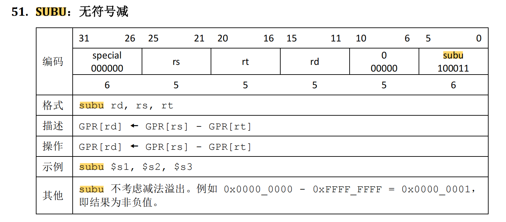

# 00CPU设计文档（Logisim单周期）

## 设计草稿

### 需要实现的指令

处理器为 32 位单周期处理器，应支持的指令集为：

```
add, sub, ori, lw, sw, beq, lui, nop
```

其中：

- `nop` 为空指令，机器码 `0x00000000`，不进行任何有效行为（修改寄存器等）。
- `add, sub` 按无符号加减法处理（不考虑溢出）。实际上是addu，subu

#### R类型指令

##### addu

题目要求是实现不考虑溢出的add，所以实际使用add的机器码


##### subu

题目要求是实现不考虑溢出的sub，所以实际使用sub的机器码



##### jr


##### j


##### sll


#### I类型指令

##### lw


##### lh


##### lb


##### sw


##### sh


##### sb


##### beq


##### lui


##### ori


#### J类型指令

##### jal


##### jalr


#### 空指令

##### nop

事实上，实现 `nop` 空指令，我们并不需要将它加入控制信号真值表。

### 模块设计

#### PC

##### 模块说明

程序计数器，包括一个32位寄存器

##### 端口说明

| 信号名    | 方向 | 描述                                                       |
| --------- | ---- | ---------------------------------------------------------- |
| clk       | I    | 时钟信号                                                   |
| reset     | I    | 复位信号，将程序计数器中的值清零<br />1：复位<br />0：无效 |
| NPC[31:0] | I    | 下一条指令的地址                                           |
| PC[31:0]  | O    | 当前指令的地址                                             |

##### 功能定义

| 序号 | 功能名称 | 描述                                                      |
| ---- | -------- | --------------------------------------------------------- |
| 1    | 复位     | reset信号有效时，程序计数器中存储的数值清零               |
| 2    | 读指令   | 当时钟上升沿来临时，从PC‘读入下一条指令的地址，并输出到PC |

#### NPC

##### 模块说明

计算下一条指令的地址

##### 端口说明

| 信号名      | 方向 | 描述                                                         |
| ----------- | ---- | ------------------------------------------------------------ |
| PC[31:0]    | I    | 32位输入                                                     |
| Imm26[25:0] | I    | 26位立即数                                                   |
| RA[31:0]    | I    | 32位返回地址（jr指令）                                       |
| Zero        | I    | rs和rt相等标志<br />1：相等<br />0：不等                     |
| NPCOp[2:0]  | I    | NPC功能选择<br />000：计算顺序地址（PC+4）<br />001：计算beq地址<br />010：计算jal地址<br />011：计算jr地址 |
| NPC[31:0]   | O    | 32位输出，下一条指令的地址                                   |
| PC4[31:0]   | O    | 32位输出，PC+4                                               |

##### 功能定义

| 序号 | 功能名称    | 描述                                                         |
| ---- | ----------- | ------------------------------------------------------------ |
| 1    | 计算PC+4    | NPC<=PC+4                                                    |
| 2    | 计算beq地址 | 如果Zero=1，NPC<=PC+4+sign_extend(offset\|\|0²)<br />如果Zero=0，NPC<=PC+4<br />备注：offset其实就是Imm26[15:0] |
| 3    | 计算jal地址 | PC<=PC[31:28]\|\|Imm26\|\|0²                                 |
| 4    | 计算jr地址  | PC<=GRF[rs]                                                  |

#### IM

##### 模块说明

指令存储器，包括一个ROM，地址位宽5，数据位宽32

##### 端口说明

| 信号名   | 方向 | 描述                                                         |
| -------- | ---- | ------------------------------------------------------------ |
| A[31:0]  | I    | 当前指令的地址<br />注意，由于ROM地址位宽为5，IM将使用A[6:2]作为实际地址 |
| RD[31:0] | O    | 当前指令的内容                                               |

##### 功能定义

| 序号 | 功能名称     | 描述                                                    |
| ---- | ------------ | ------------------------------------------------------- |
| 1    | 读取指令内容 | 取出指令存储器中，5位地址A[6:2]指向的32位指令，输出到RD |

#### GRF

##### 模块说明

寄存器堆

##### 端口说明

| 信号名    | 方向 | 描述                                                         |
| --------- | ---- | ------------------------------------------------------------ |
| clk       | I    | 时钟信号                                                     |
| reset     | I    | 复位信号，将32个寄存器中的值全部清零<br />1：复位<br />0：无效 |
| A1[4:0]   | I    | 5位地址输入信号，指定32个寄存器中的一个，将其中存储的数据读出到RD1 |
| A2[4:0]   | I    | 5位地址输入信号，指定32个寄存器中的一个，将其中存储的数据读出到RD2 |
| A3[4:0]   | I    | 5位地址输入信号，指定32个寄存器中的一个，作为写入的目标寄存器 |
| WD[31:0]  | I    | 32位数据输入信号                                             |
| WE        | I    | 写使能信号                                                   |
| RD1[31:0] | O    | 输出A1指定的寄存器中的32位数据                               |
| RD2[31:0] | O    | 输出A2指定的寄存器中的32位数据                               |

##### 功能定义

| 序号 | 功能名称 | 描述                                                   |
| ---- | -------- | ------------------------------------------------------ |
| 1    | 复位     | reset信号有效时，所有寄存器存储的数值清零              |
| 2    | 读数据   | 读出A1，A2地址对应寄存器中所存储的数据到RD1，RD2       |
| 3    | 写数据   | 当WE有效且时钟上升沿来临时，将WD写入A3所对应的寄存器中 |

#### EXT

##### 模块说明

立即数扩展单元

##### 端口说明

| 信号名     | 方向 | 描述                                                         |
| ---------- | ---- | ------------------------------------------------------------ |
| I[15:0]    | I    | 16位立即数输入                                               |
| EXTOp[2:0] | I    | 3位扩展方式选择信号<br />000：无符号扩展<br />001：有符号扩展<br />010：将低16位加载到高16位 |
| O[31:0]    | O    | 32位输出                                                     |

##### 功能定义

| 序号 | 功能名称           | 描述      |
| ---- | ------------------ | --------- |
| 1    | 无符号扩展         | EXTOp=000 |
| 2    | 有符号扩展         | EXTOp=001 |
| 3    | 低16位加载到高16位 | EXTOp=010 |

#### ALU

##### 模块说明

算术逻辑单元

##### 端口说明

| 信号名       | 方向 | 描述                                                         |
| ------------ | ---- | ------------------------------------------------------------ |
| A[31:0]      | I    | 运算数A                                                      |
| B[31:0]      | I    | 运算数B                                                      |
| shamt[4:0]   | I    | 移位数(sll指令)                                              |
| ALUOp[3:0]   | I    | 运算操作选择信号<br />0000：A&B<br />0001：A\|B<br />0010：A+B<br />0011(beq)：A-B<br />0100(sll)：逻辑左移，B左移shamt位 |
| Result[31:0] | O    | 32位运算结果                                                 |
| Zero         | O    | A和B相等则输出为1，否则输出为0，依靠减法器实现，需要将ALUOperation置为0110 |

##### 功能定义

| 序号 | 功能名称         | 描述                 |
| ---- | ---------------- | -------------------- |
| 1    | A&B              | ALUOp=0000           |
| 2    | A\|B             | ALUOp=0001           |
| 3    | A+B              | ALUOp=0010           |
| 4    | A-B              | ALUOp=0011           |
| 5    | 判断A与B是否相等 | ALUOp=0011(需要减法) |
| 6    | B逻辑左移shamt位 | ALUOp=0100           |

#### DM

##### 模块说明

数据存储器（内存），包括1个RAM，地址位宽5，数据位宽32

##### 端口说明

| 信号名    | 方向 | 描述                                                         |
| --------- | ---- | ------------------------------------------------------------ |
| clk       | I    | 时钟信号                                                     |
| reset     | I    | 复位信号，将数据存储器中的值全部清零<br />1：复位<br />0：无效 |
| A[31:0]   | I    | 32位地址输入信号<br />注意，由于RAM地址位宽为5，DM将使用A[6:2]作为实际地址 |
| WE        | I    | 写使能信号                                                   |
| WD[31:0]  | I    | 32位数据输入                                                 |
| LSel[2:0] | I    | 读取指令<br />000：lw指令<br />001：lh指令<br />010：lb指令  |
| SSel[2:0] | I    | 存储指令<br />000：sw指令<br />001：sh指令<br />010：sb指令  |
| RD[31:0]  | O    | 输出数据存储器中地址A指向的32位数据                          |

##### 功能定义

| 序号 | 功能名称 | 描述                                                  |
| ---- | -------- | ----------------------------------------------------- |
| 1    | 复位     | 将内存中数据清零                                      |
| 2    | 写入内存 | 当WE有效且时钟上升沿来临时，将WD写入地址A指向的内存中 |
| 3    | 读取内存 | 取出内存中，5位地址A[6:2]指向的32位数据，输出到RD     |

#### SPLITTER

##### 模块说明

指令分线器，将指令各个有意义的片段分开

##### 端口说明

| 信号名           | 方向 | 描述             |
| ---------------- | ---- | ---------------- |
| I[31:0]          | I    | 指令的32位机器码 |
| Op 31-26[5:0]    | O    |                  |
| Func 5-0[5:0]    | O    |                  |
| Rs 25-21[5:0]    | O    |                  |
| Rt 20-16[5:0]    | O    |                  |
| Rd 15-11[5:0]    | O    |                  |
| Imm 15-0[15:0]   | O    |                  |
| Shamt 10-6[4:0]  | O    |                  |
| Imm26 25-0[25:0] | O    |                  |

##### 功能定义

| 序号 | 功能名称       | 描述             |
| ---- | -------------- | ---------------- |
| 1    | 分割指令机器码 | 将有意义片段输出 |

#### Control

##### 模块说明

控制单元

##### 端口说明

| 信号名          | 方向 | 描述                                                         |
| --------------- | ---- | ------------------------------------------------------------ |
| Op[5:0]         | I    | 32位机器码的Op 31-26部分                                     |
| Func[5:0]       | I    | 32位机器码的Func 5-0部分                                     |
| RegDstSel[2:0]  | O    | 寄存器堆写入地址选择<br />000：指令机器码的Rt 20-16部分<br />001：指令机器码的Rd 15-11部分<br />010：0x1f（31），用于jal指令 |
| ALUSrcSel[2:0]  | O    | ALU运算数B选择<br />000：寄存器堆的输出RD2<br />001：立即数扩展单元的输出O |
| toRegSel[2:0]   | O    | 寄存器堆写入数据选择<br />000：ALU的运算结果<br />001：内存DM中读取的数据RD<br />010：立即数扩展单元的输出O<br />011：PC4（用于jal指令） |
| RegWrite        | O    | 寄存器堆写使能控制信号                                       |
| MemRead(未设计) | O    | 内存读使能控制信号                                           |
| MemWrite        | O    | 内存写使能控制信号                                           |
| NPCOp[2:0]      | O    | NPC功能选择<br />000：计算顺序地址（PC+4）<br />001：计算beq地址<br />010：计算jal/j地址<br />011：计算jr/jalr地址 |
| ALUOp[3:0]      | O    | 选择ALU的运算类型<br />0000：A&B<br />0001：A\|B<br />0010：A+B<br />0011：A-B |
| EXTOp[2:0]      | O    | 选择立即数扩展单元EXT的扩展类型：<br />000：无符号扩展<br />001：有符号扩展<br />010：将低16位加载到高16位 |
| LSel[2:0]       | O    | 读取指令<br />000：lw指令<br />001：lh指令<br />010：lb指令  |
| SSel[2:0]       | O    | 存储指令<br />000：sw指令<br />001：sh指令<br />010：sb指令  |


### 控制单元真值表

| 指令 | Op     | Func   | RegDstSel[2:0]  | ALUSrcSel[2:0] | toRegSel[2:0] | RegWrite | MemRead(DM未设计) | MemWrite | NPCOp[2:0] | ALUOp[3:0]     | EXTOp[2:0]      | SSel[2:0] | LSel[2:0] | 其他     |
| ---- | ------ | ------ | --------------- | -------------- | ------------- | -------- | ----------------- | -------- | ---------- | -------------- | --------------- | --------- | --------- | -------- |
| addu | 000000 | 100000 | 001(rd)         | 000(RD2)       | 000(ALUtoReg) | 1        | 0                 | 0        | 000(PC4)   | 0010(加)       | X               | X         | X         |          |
| subu | 000000 | 100010 | 001(rd)         | 000(RD2)       | 000(ALUtoReg) | 1        | 0                 | 0        | 000(PC4)   | 0011(减)       | X               | X         | X         |          |
| sll  | 000000 | 000000 | 001(rd)         | 000(RD2)       | 000(ALUtoReg) | 1        | 0                 | 0        | 000(PC4)   | 0100(逻辑左移) | X               | X         | X         |          |
| lw   | 100011 |        | 000(rt)         | 001(EXT)       | 001(MemtoReg) | 1        | 1                 | 0        | 000(PC4)   | 0010(加)       | 001(有符号拓展) | X         | 000(字)   |          |
| lh   | 100001 |        | 000(rt)         | 001(EXT)       | 001(MemtoReg) | 1        | 1                 | 0        | 000(PC4)   | 0010(加)       | 001(有符号拓展) | X         | 001(半字) |          |
| lb   | 100000 |        | 000(rt)         | 001(EXT)       | 001(MemtoReg) | 1        | 1                 | 0        | 000(PC4)   | 0010(加)       | 001(有符号拓展) | X         | 010(字节) |          |
| sw   | 101011 |        | X               | 001(EXT)       | X             | 0        | 0                 | 1        | 000(PC4)   | 0010(加)       | 001(有符号拓展) | 000(字)   | X         |          |
| sh   | 101001 |        | X               | 001(EXT)       | X             | 0        | 0                 | 1        | 000(PC4)   | 0010(加)       | 001(有符号拓展) | 001(半字) | X         |          |
| sb   | 101000 |        | X               | 001(EXT)       | X             | 0        | 0                 | 1        | 000(PC4)   | 0010(加)       | 001(有符号拓展) | 010(字节) | X         |          |
| beq  | 000100 |        | X               | 000(RD2)       | X             | 0        | 0                 | 0        | 001(beq)   | 0011(减)       | X               | X         | X         | 需要zero |
| lui  | 001111 |        | 000(rt)         | X              | 010(ExttoReg) | 1        | 0                 | 0        | 000(PC4)   | X              | 010(加载到高位) | X         | X         |          |
| ori  | 001101 |        | 000(rt)         | 001(EXT)       | 000(ALUtoReg) | 1        | 0                 | 0        | 000(PC4)   | 0001(或)       | 000(无符号拓展) | X         | X         |          |
| j    | 000010 |        | X               | X              | X             | 0        | 0                 | 0        | 010(jal)   | X              | X               | X         | X         |          |
| jal  | 000011 |        | 010(31号寄存器) | X              | 011(PC4toReg) | 1        | 0                 | 0        | 010(jal)   | X              | X               | X         | X         |          |
| jr   | 000000 | 001000 | X               | X              | X             | 0        | 0                 | 0        | 011(jr)    | X              | X               | X         | X         |          |
| jalr | 000000 | 001001 | 001(rd)         | X              | 011(PC4toReg) | 1        | 0                 | 0        | 011(jr)    | X              | X               | X         | X         |          |

## 版本迭代

### cpu V1.0.circ

- 仅仅实现题目要求的指令：add, sub, ori, lw, sw, beq, lui, nop

### cpu V2.0.circ

- 修改了数据通路的外观，便于添加指令

### cpu V2.1.circ

- 扩展了控制信号的位数，规范化控制器的输出
- 新支持的指令：jr, j, jal, jalr
- 修改IM与PC，解决了思考题Q5

### cpu V2.2.circ

- 新支持的指令：lh，lb，sh，sb，sll

- 截止目前，支持的指令为：

  ```
  add, sub, ori, lw, sw, beq, lui, nop, jr, j, jal, jalr, lh，lb，sh，sb，sll
  ```

  

### cpu V2.2.circ

- 

  如上图P3课下要求，注意到IFU地址为0x0000_0000，而非0x3000_0000，故删去V2.1中对思考题Q5的处理，即把IM和PC的修改撤销

## 测试方案

见文件

## 思考题

### Q1

上面我们介绍了通过 FSM 理解单周期 CPU 的基本方法。请大家指出单周期 CPU 所用到的模块中，哪些发挥状态存储功能，哪些发挥状态转移功能。

答

状态存储：PC，GRF，DM

状态转移：NPC，IM，EXT，ALU，CONTROL

### Q2

现在我们的模块中 IM 使用 ROM， DM 使用 RAM， GRF 使用 Register，这种做法合理吗？ 请给出分析，若有改进意见也请一并给出。

答

在Logisim中合理。IM在本次实现中只读即可，ROM满足需求。DM需要读写且所需空间更大，ROM比寄存器更合适。GRF需要被频繁调用，使用寄存器实现的效率最高。

实际应用上，指令存储器为ROM时，存在过度简化。在大多数实际处理器中，指令存储器必须是可写的，从而使操作系统可以载入一个新的程序到存储器中。7.4节所描述的多周期微结构更符合实际，它使用混合存储器来存储指令和数据，使得它们既可读又可写。【参考资料：数字设计和计算机体系结构】

### Q3

在上述提示的模块之外，你是否在实际实现时设计了其他的模块？如果是的话，请给出介绍和设计的思路。

答

SPLITTER，用于分出指令中的有意义字段。详见上面的模块介绍部分。

### Q4

事实上，实现 `nop` 空指令，我们并不需要将它加入控制信号真值表，为什么？

答

因为nop不需要任何的控制信号。执行nop指令时，只有PC增加4，其他寄存器或内存中的值均不变。

### Q5

上文提到，MARS 不能导出 PC 与 DM 起始地址均为 0 的机器码。实际上，可以避免手工修改的麻烦。请查阅相关资料进行了解，并阐释为了解决这个问题，你最终采用的方法。

答

如图，

在IM模块中添加一个减法器，使**实际在IM中存储的地址=指令中读取的地址-0x3000_0000**

在PC模块中**异步复位到0x3000_0000**


### Q6

阅读 Pre 的 [“MIPS 指令集及汇编语言”](http://cscore.buaa.edu.cn/tutorial/mips/mips-6/mips6-1/) 一节中给出的测试样例，评价其强度（可从各个指令的覆盖情况，单一指令各种行为的覆盖情况等方面分析），并指出具体的不足之处。

答

ori指令，lui指令，add指令：测试数据少，覆盖范围不足

sw指令，lw指令：offset的正负零覆盖不足，\$base寄存器的正负零覆盖不足，缺少对目标寄存器是\$0寄存器的测试

beq指令：需要构造更多寄存器数据，测试多种比较情况和跳转执行的正确性
