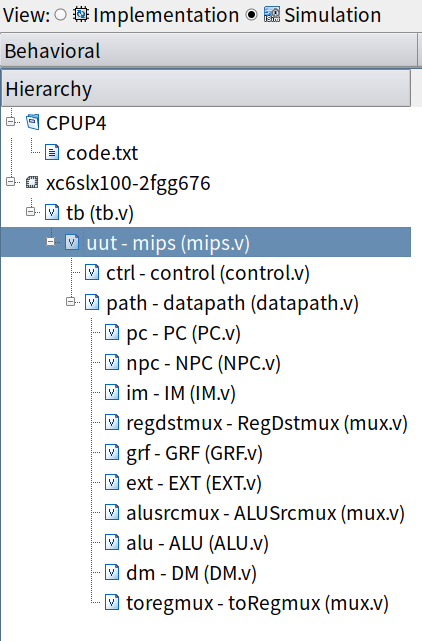
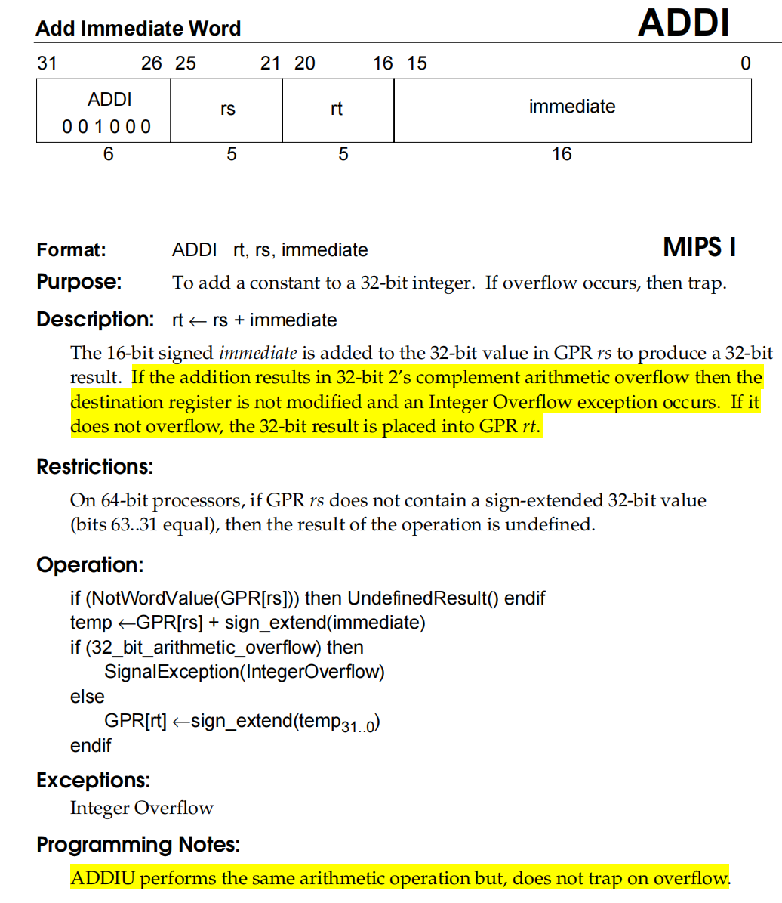
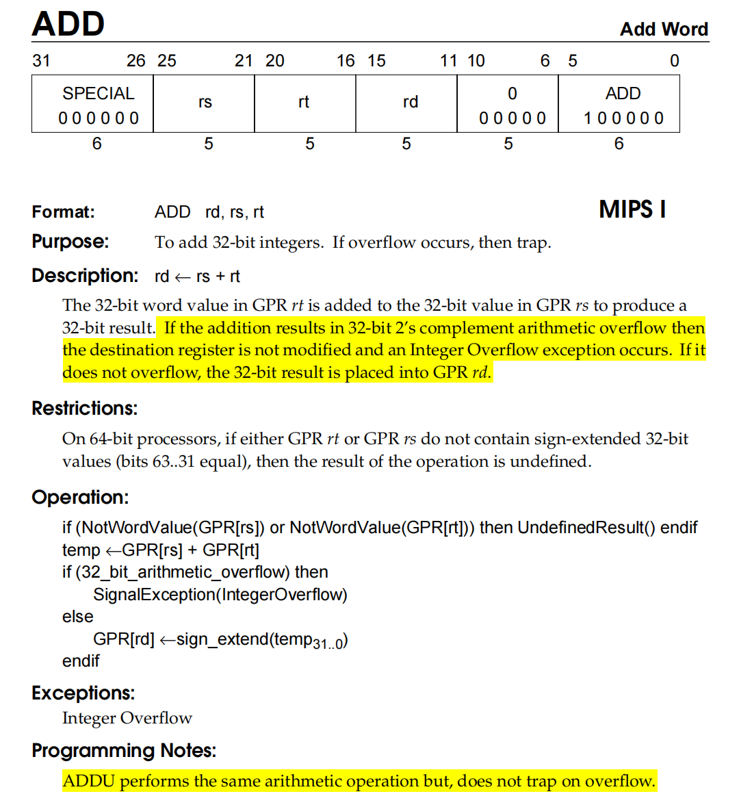
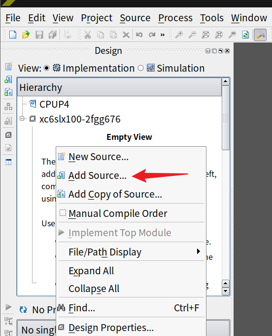

# CPU设计文档（Verilog单周期）

## 文件结构



- mips.v
  - control.v
  - datapath.v
    - PC.v
    - NPC.v
    - IM.v
    - mux.v
    - GRF.v
    - EXT.v
    - ALU.v
    - DM.v

## 实现的指令

课下要求10条（包括nop）：**add, sub, ori, lw, sw, beq, lui, jal, jr, nop**

备注：这里的add和sub不处理溢出

## 模块设计

### PC

**模块说明**

程序计数器

包括一个32位寄存器pc

**端口说明**

| 信号名    | 方向 | 描述             |
| --------- | ---- | ---------------- |
| clk       | I    | 时钟信号         |
| reset     | I    | 复位寄存器pc     |
| NPC[31:0] | I    | 下一条指令的地址 |
| PC[31:0]  | O    | 当前指令的地址   |

**功能定义**

| 序号 | 功能名称             | 描述                        |
| ---- | -------------------- | --------------------------- |
| 1    | 复位                 | reset=1，寄存器清零         |
| 2    | 读入下一条指令的地址 | 时钟上升沿，寄存器pc读入NPC |

### NPC

**模块说明**

计算下一条指令的地址

**端口说明**

| 信号名      | 方向 | 描述                                                         |
| ----------- | ---- | ------------------------------------------------------------ |
| PC[31:0]    | I    | 当前指令的地址                                               |
| Imm26[25:0] | I    | 26位立即数                                                   |
| RA[31:0]    | I    | 32位返回地址（jr指令）                                       |
| Zero        | I    | GRF[Rs]和GRF[Rt]相等标志<br />1：相等<br />0：不等           |
| NPCOp[2:0]  | I    | NPC功能选择<br />000：计算顺序地址（PC+4）<br />001：计算beq地址<br />010：计算jal地址<br />011：计算jr地址 |
| NPC[31:0]   | O    | 下一条指令的地址                                             |
| PC4[31:0]   | O    | 32位输出，PC+4                                               |

**功能定义**

| 序号 | 功能名称    | 描述                                                         |
| ---- | ----------- | ------------------------------------------------------------ |
| 1    | 计算PC+4    | NPC<=PC+4                                                    |
| 2    | 计算beq地址 | 如果Zero=1，NPC<=PC+4+sign_extend(offset\|\|0²)<br />如果Zero=0，NPC<=PC+4<br />备注：offset其实就是Imm26[15:0] |
| 3    | 计算jal地址 | PC<=PC[31:28]\|\|Imm26\|\|0²                                 |
| 4    | 计算jr地址  | PC<=GRF[Rs]                                                  |

### IM

**模块说明**

指令存储器

包括由4096个32位寄存器组成的寄存器数组im

```
reg [31:0] im[4095:0];
```

4096=2^12，所以寄存器数组地址的位宽为12

注意：

Verilog中，**寄存器的默认值是X而非0**。

由于IM没有reset信号输入，所以reset信号无法完成IM的复位。

所以在读入指令前，需要先给寄存器数组手动复位。

具体步骤：在initial块中，先使用循环给寄存器数组复位，再让寄存器数组从文件读入指令，代码如下

```verilog
    integer i;
    initial begin
        //先手动复位
        for(i=0; i<4096; i=i+1) begin
            im[i]=32'h0;
        end
        //再从文件读入指令
        $readmemh("code.txt", im);
    end
```


**端口说明**

| 信号名   | 方向 | 描述                                                         |
| -------- | ---- | ------------------------------------------------------------ |
| A[31:0]  | I    | 当前指令的地址<br />注意，由于代码段地址起始位置为0x0000_3000，而我们想要从0开始给寄存器数组中的寄存器编号，所以令Asub=A-32'h0000_3000<br />注意，由于寄存器数组地址位宽为12，并且由于按字寻址（低两位是字内的字节地址，不考虑），所以使用Asub[13:2]（12位wire）作为寻找某个寄存器的实际地址 |
| RD[31:0] | O    | 当前指令的机器码                                             |

**功能定义**

| 序号 | 功能名称     | 描述                                                         |
| ---- | ------------ | ------------------------------------------------------------ |
| 1    | 读取指令内容 | 输出指令存储器中(A-32'h0000_3000)[13:2]指向的32位指令的机器码，即 im[(A-32'h0000_3000)[13:2]] 到RD<br />说明：(A-32'h0000_3000)[13:2]不是verilog中语法，只是伪代码 |

### RegDstmux

**注意：m 是小写！**

**模块说明**

多路选择器，选择要写入GRF的哪一个寄存器

**端口说明**

数据为 **5** 位！

| 信号名         | 方向 | 描述                                                         |
| -------------- | ---- | ------------------------------------------------------------ |
| RegDstSel[2:0] | I    | 寄存器堆写入地址选择<br />000：指令机器码的Rt 20-16部分<br />001：指令机器码的Rd 15-11部分<br />010：0x1f（31），用于jal指令 |
| input0[4:0]    | I    | 第0(000)路输入                                               |
| input1[4:0]    | I    | 第1(001)路输入                                               |
| input2[4:0]    | I    | 第2(010)路输入                                               |
| RegDst[4:0]    | O    | 选择的某路输入，作为寄存器堆写入地址                         |


### GRF

**模块说明**

寄存器堆

包括由31个32位寄存器组成的寄存器数组rf

```
reg [31:0] rf[31:1];
```

**端口说明**

| 信号名    | 方向 | 描述                         |
| --------- | ---- | ---------------------------- |
| clk       | I    | 时钟信号                     |
| reset     | I    | 复位寄存器数组rf             |
| A1[4:0]   | I    | RD1<=rf[**A1**]              |
| A2[4:0]   | I    | RD2<=rf[**A2**]              |
| A3[4:0]   | I    | rf[**A3**]<=WD               |
| WD[31:0]  | I    | rf[A3]<=**WD**               |
| WE        | I    | 写使能信号                   |
| pc[31:0]  | I    | 相应指令的储存地址，用于测评 |
| RD1[31:0] | O    | **RD1**<=rf[A1]              |
| RD2[31:0] | O    | **RD2**<=rf[A2]              |

**功能定义**

| 序号 | 功能名称 | 描述                                                   |
| ---- | -------- | ------------------------------------------------------ |
| 1    | 复位     | reset信号有效时，复位寄存器数组rf                      |
| 2    | 读数据   | 输出A1，A2地址对应寄存器的数据到RD1，RD2               |
| 3    | 写数据   | 当WE有效且时钟上升沿来临时，将WD写入A3地址对应的寄存器 |

**备注**

对0号寄存器写入，display与否都可以，评测机会忽略。

### EXT

**模块说明**

立即数扩展单元

**端口说明**

| 信号名     | 方向 | 描述                                                         |
| ---------- | ---- | ------------------------------------------------------------ |
| I[15:0]    | I    | 16位立即数输入                                               |
| EXTOp[2:0] | I    | 3位扩展方式选择信号<br />000：无符号扩展<br />001：有符号扩展<br />010：将低16位加载到高16位 |
| O[31:0]    | O    | 32位输出                                                     |

**功能定义**

| 序号 | 功能名称           | 描述      |
| ---- | ------------------ | --------- |
| 1    | 无符号扩展         | EXTOp=000 |
| 2    | 有符号扩展         | EXTOp=001 |
| 3    | 低16位加载到高16位 | EXTOp=010 |

### ALUSrcmux

**注意：m 是小写！**

**模块说明**

多路选择器，选择ALU运算数B的来源

**端口说明**

数据为 **32** 位！

| 信号名         | 方向 | 描述                                                         |
| -------------- | ---- | ------------------------------------------------------------ |
| ALUSrcSel[2:0] | I    | ALU运算数B选择<br />000：寄存器堆的输出RD2<br />001：立即数扩展单元的输出O |
| input0[31:0]   | I    | 第0(000)路输入                                               |
| input1[31:0]   | I    | 第1(001)路输入                                               |
| ALUSrc[31:0]   | O    | 选择的某路输入，作为ALU运算数B                               |

### ALU

**模块说明**

算术逻辑单元

**端口说明**

| 信号名       | 方向 | 描述                                                         |
| ------------ | ---- | ------------------------------------------------------------ |
| A[31:0]      | I    | 运算数A                                                      |
| B[31:0]      | I    | 运算数B                                                      |
| *shamt[4:0]* | *I*  | *移位数(sll指令)*                                            |
| ALUOp[3:0]   | I    | 运算操作选择信号<br />0000：A&B<br />0001：A\|B<br />0010：A+B<br />0011(beq)：A-B<br />*0100(sll)：逻辑左移，B左移shamt位* |
| Result[31:0] | O    | 32位运算结果                                                 |
| Zero         | O    | A和B相等则输出为1，否则输出为0，依靠减法器实现，需要将ALUOperation置为0110 |

**功能定义**

| 序号 | 功能名称           | 描述                                       |
| ---- | ------------------ | ------------------------------------------ |
| 1    | A&B                | ALUOp=0000                                 |
| 2    | A\|B               | ALUOp=0001                                 |
| 3    | A+B                | ALUOp=0010                                 |
| 4    | A-B                | ALUOp=0011                                 |
| 5    | 判断A与B是否相等   | ALUOp=X<br />（与Logisim不同，不需要减法） |
| *6*  | *B逻辑左移shamt位* | *ALUOp=0100*                               |

### DM

**模块说明**

数据存储器（内存）

包括由3072个32位寄存器组成的寄存器数组dm

```
reg [31:0] dm[3071:0];
```

2\^11=2048<**3072**<4096=2^12，所以寄存器数组地址的位宽为12

**端口说明**

| 信号名      | 方向 | 描述                                                         |
| ----------- | ---- | ------------------------------------------------------------ |
| clk         | I    | 时钟信号                                                     |
| reset       | I    | 复位寄存器数组dm                                             |
| A[31:0]     | I    | 写入的地址<br />注意，由于寄存器地址位宽为12，且按字寻址，DM将使用A[13:2]作为实际地址<br />dm[**A[13:2]**] <= WD |
| WE          | I    | 写使能信号                                                   |
| WD[31:0]    | I    | 写入的数据<br />dm[A[13:2]] <= **WD**                        |
| pc[31:0]    | I    | 相应指令的储存地址，用于测评                                 |
| *LSel[2:0]* | *I*  | *读取指令<br />000：lw指令<br />001：lh指令<br />010：lb指令* |
| *SSel[2:0]* | *I*  | *存储指令<br />000：sw指令<br />001：sh指令<br />010：sb指令* |
| RD[31:0]    | O    | 输出地址A指向的数据<br />**RD** = dm[A[13:2]]                |

**功能定义**

| 序号 | 功能名称 | 描述                                                         |
| ---- | -------- | ------------------------------------------------------------ |
| 1    | 复位     | 清零寄存器数组(内存)                                         |
| 2    | 写入内存 | 当WE有效且时钟上升沿来临时，将WD写入12位地址A[13:2]指向的内存中<br />dm[A[13:2]] <= WD |
| 3    | 读取内存 | 取出内存中，12位地址A[13:2]指向的32位数据，输出到RD<br />RD = dm[A[13:2]] |

### toRegmux

**注意：开头的 t 是小写！**

**注意：m 是小写！**

**模块说明**

多路选择器，选择要写入GRF的数据

**端口说明**

数据为 **32** 位！

| 信号名        | 方向 | 描述                                                         |
| ------------- | ---- | ------------------------------------------------------------ |
| toRegSel[2:0] | I    | 寄存器堆写入数据选择<br />000：ALU的运算结果<br />001：内存DM中读取的数据RD<br />010：立即数扩展单元的输出O<br />011：PC4（用于jal指令） |
| input0[31:0]  | I    | 第0(000)路输入                                               |
| input1[31:0]  | I    | 第1(001)路输入                                               |
| input2[31:0]  | I    | 第2(010)路输入                                               |
| input3[31:0]  | I    | 第3(011)路输入                                               |
| toReg[31:0]   | O    | 选择的某路输入，作为寄存器堆写入数据                         |

### Control

**模块说明**

控制单元

**端口说明**

| 信号名          | 方向 | 描述                                                         |
| --------------- | ---- | ------------------------------------------------------------ |
| Op[5:0]         | I    | 32位机器码的Op 31-26部分                                     |
| Func[5:0]       | I    | 32位机器码的Func 5-0部分                                     |
| RegDstSel[2:0]  | O    | 寄存器堆写入地址选择<br />000：指令机器码的Rt 20-16部分<br />001：指令机器码的Rd 15-11部分<br />010：0x1f（31），用于jal指令 |
| ALUSrcSel[2:0]  | O    | ALU运算数B选择<br />000：寄存器堆的输出RD2<br />001：立即数扩展单元的输出O |
| toRegSel[2:0]   | O    | 寄存器堆写入数据选择<br />000：ALU的运算结果<br />001：内存DM中读取的数据RD<br />010：立即数扩展单元的输出O<br />011：PC4（用于jal指令） |
| RegWrite        | O    | 寄存器堆写使能控制信号                                       |
| MemRead(未设计) | O    | 内存读使能控制信号                                           |
| MemWrite        | O    | 内存写使能控制信号                                           |
| NPCOp[2:0]      | O    | NPC功能选择<br />000：计算顺序地址（PC+4）<br />001：计算beq地址<br />010：计算jal/j地址<br />011：计算jr/jalr地址 |
| ALUOp[3:0]      | O    | 选择ALU的运算类型<br />0000：A&B<br />0001：A\|B<br />0010：A+B<br />0011：A-B |
| EXTOp[2:0]      | O    | 选择立即数扩展单元EXT的扩展类型：<br />000：无符号扩展<br />001：有符号扩展<br />010：将低16位加载到高16位 |
| *LSel[2:0]*     | *O*  | *读取指令<br />000：lw指令<br />001：lh指令<br />010：lb指令* |
| *SSel[2:0]*     | *O*  | *存储指令<br />000：sw指令<br />001：sh指令<br />010：sb指令* |

## 思考题

1. 阅读下面给出的 DM 的输入示例中（示例 DM 容量为 4KB，即 32bit × 1024字），根据你的理解回答，这个 addr 信号又是从哪里来的？地址信号 addr 位数为什么是 [11:2] 而不是 [9:0] ？

   

   来自ALU的计算结果输出ALUResult[11:2]。

   因为按字寻址而非按字节寻址，所以addr[11:2] = ALUResult[11:2].

   虽然addr[9:0] = ALUResult[11:2]在实现上也是正确的，但addr[11:2] = ALUResult[11:2]使用完全相同的下标一一对应，起到了提醒数据来源具体所取位的作用。

2. 思考上述两种控制器设计的译码方式，给出代码示例，并尝试对比各方式的优劣。

   方式一：**指令对应的控制信号如何取值**

   ```
   case (Instr[31:26])
       R:  begin
           case (Instr[5:0])
               add: begin
                   grf_en  = 1;
                   dm_en   = 0;
                   alu_op  = 0;
                   npc_sel = 0;
                   // ...
               end
               // ...
           endcase
       // ...
   endcase
   ```

   优点：便于指令的添加，不易遗漏控制信号

   缺点：整体代码量会随指令数量增多而显著增大

   方式二：**控制信号每种取值所对应的指令**

   ```verilog
   wire    R       = (op == 6'b000000);
   wire    add     = R & (func == 6'b100001);
   wire    sub     = R & (func == 6'b100011);
   // wire ...
   
   assign grf_en = (add | sub | /*...*/) ? 1'b1 : 1'b0;
   
   // assign ...
   ```

   优点：在指令数量较多时适用，且代码量易于压缩

   缺点：如错添或漏添了某条指令，很难锁定出现错误的位置

3. 在相应的部件中，复位信号的设计都是**同步复位**，这与 P3 中的设计要求不同。请对比**同步复位**与**异步复位**这两种方式的 reset 信号与 clk 信号优先级的关系。

   同步复位：clk优先级大于reset。复位信号只有在时钟上升沿到来时才能有效。

   异步复位：reset优先级大于clk。无论时钟沿是否到来，只要复位信号有效，就进行复位。

4. C 语言是一种弱类型程序设计语言。C 语言中不对计算结果溢出进行处理，这意味着 C 语言要求程序员必须很清楚计算结果是否会导致溢出。因此，如果仅仅支持 C 语言，MIPS 指令的所有计算指令均可以忽略溢出。 请说明为什么在忽略溢出的前提下，addi 与 addiu 是等价的，add 与 addu 是等价的。提示：阅读《MIPS32® Architecture For Programmers Volume II: The MIPS32® Instruction Set》中相关指令的 Operation 部分。

   

   

## 易错点

- 变量名的拼写，以及大小写

- 数据的位数

- 阻塞赋值与非阻塞赋值
  - 时序逻辑，非阻塞赋值<=，并行执行
  - 组合逻辑，阻塞赋值=，顺序执行
  
- 逻辑右移运算符 `>>` 与算术右移运算符 `>>>`

  它们的区别主要在于前者在最高位**补 0**，而后者在最高位**补符号位**。

## 课上准备

### 如何把课下提交的cpu文件导入到新的ISE项目

- 在课下提交时，包括tb.v与code.txt文件，省去上机时新建文件的时间。

1. 准备好文件（**包括tb.v和code.txt**），放到共享文件夹内

2. 右键 - **Add Copy of Source**

   

3. 选择准备好的文件 - 点击OK

### 注意事项

**注意**
测评输出可能会要求字对齐 意思是输出地址时低两位改为0

**练习**
**计算类指令**
注意掩码的运用
sll注意运算数是rt指向的RD2，ALU中是B不是A左移

**访存类指令**
swrr
lwrr
lha

**跳转类指令**
bsoal
注意for循环中间变量的清零问题
异或缩减运算符 利用异或的性质判断二进制数中1的个数的奇偶性
bazeal
bnezalc
alu新运算判断结果为1时，才写寄存器，可以给alu添加输出flag，控制器添加输入flag
在控制信号表达式中，寄存器写使能为 (其他指令 或 (新指令 & flag))
npc的输出选择也取决于flag，可以在npc接入flag，也可以在控制器中像上面那样直接构建npcop的表达式。

