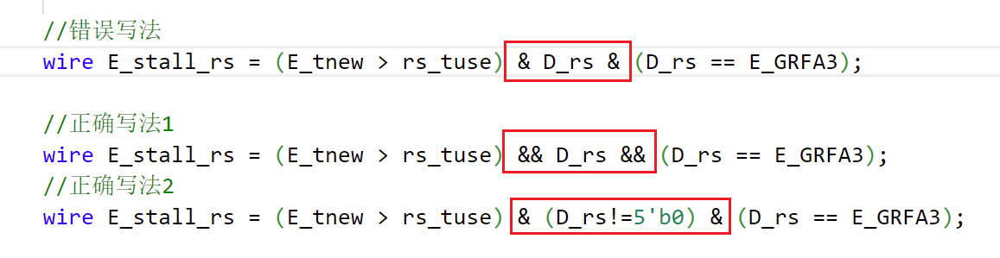

[TOC]


# CPU设计文档 P5

## 设计说明

1. 处理器支持如下指令集：{ add, sub, ori, lw, sw, beq, lui, jal, jr, nop }。共10条。

   注：这里的add和sub不处理溢出。

2. 处理器为五级流水线设计。

## 设计要求

1. 流水线的设计以追求性能为第一目标，因此必须尽最大可能**支持转发**以解决数据冒险。这一点在本 project 的最终成绩中所占比重较大，课上测试时会通过测试程序所运行的**总周期数**进行判定，望大家慎重对待。
2. 对于 b 类和 j 类指令， 流水线设计必须**支持延迟槽**，因此设计需要注意使用 **PC@D + 8**或**PC@I + 4**。
3. 为了解决数据冒险而设计的转发数据来源必须是**某级流水线寄存器**，**不允许**对功能部件的输出直接进行转发。
4. 指令存储器（IM，instruction memory）和数据存储器（DM，data memory）要求如下：
   - IM：容量为 **16KiB**（**4096** × 32bit）。
   - DM：容量为 **12KiB**（**3072** × 32bit）。
5. PC 的初始地址为 **0x00003000**，和 Mars 中我们要求设置的代码初始地址相同。
6. 最外层的 mips 模块的文件名必须为 mips.v ，该文件中的 module 也必须命名为 **mips** 。

## 测试要求

1. 你编写的汇编测试程序必须确保所有指令都应被测试充分。
2. 冲突是你的测试重点，需要覆盖性的测试每一条指令的 A、T 值是否标记正确。

## 指令分类

大类：如果指令会产生结果（写寄存器），则以产生结果的功能部件命名；否则归类为“不产生”。

小类：更具体的指令分类，比如大类ALU包括小类calr与cali。

小类写在了const.v的宏定义。

| 大类   | 小类  | 含义             | 指令     |
| ------ | ----- | ---------------- | -------- |
| PC     | jal   | 跳转并链接       | jal      |
| EXT    | lui   | 加载高位         | lui      |
| ALU    | calr  | 寄存器寄存器计算 | add, sub |
| ALU    | cali  | 寄存器立即数计算 | ori      |
| DM     | load  | 读内存           | lw       |
| 不产生 | store | 写内存           | sw       |
| 不产生 | jr    | 跳转寄存器       | jr       |
| 不产生 | beq   | 根据寄存器分支   | beq      |
| -      | -     | 空指令           | nop      |

**P5教程  - 流水线测试 - 指令类的概念**

指令类即具有实现相似性的若干指令，例如对于 MIPS-C3 指令集（包含了 P5、P6 课下要求的指令集），可以进行如下分类：

- 寄存器立即数计算：`addi, addiu, slti, sltiu, andi, ori, xori, sll, srl, sra`
- 寄存器寄存器计算：`add, addu, sub, subu, slt, sltu, and, or, nor, xor, sllv, srlv, srav`
- 根据寄存器分支：`beq, bne, bgez, bgtz, blez, bltz`
- 写内存：`sw, sh, sb`
- 读内存：`lw, lh, lhu, lb, lbu`
- 读乘除法寄存器：`mfhi, mflo`
- 写乘除法寄存器：`mthi, mtlo, mult, multu, div, divu`
- 跳转并链接：`jal, jalr`
- 跳转寄存器：`jr, jalr`
- 加载高位：`lui`
- 空指令：`nop`

上面的指令中并没有无条件跳转指令 `j`，这是因为 `j` 指令不产生数据也不使用数据，已被移出群聊，而同样不产生数据也不使用数据的 `nop` 指令由于可以方便的充当无关指令，被保留在测试指令集中。

## 流水线数据通路

见文件

## 功能部件规划

F级: IFU

D级: GRF, EXT, NPC

E级: ALU

M级: DM

W级: 无

## 流水寄存器规划

| 寄存器名 (初始值产生时间) | D_REG  | E_REG  | M_REG  | W_REG  |
| ------------------------- | ------ | ------ | ------ | ------ |
| instr (F)                 | √      | √      | √      | √      |
| pc (F)                    | √      | √      | √      | √      |
| RD1 (D)                   | 未产生 | √      | 不需要 | 不需要 |
| RD2 (D)                   | 未产生 | √      | √      | 不需要 |
| EXT32 (D)                 | 未产生 | √      | √      | √      |
| AO (E)                    | 未产生 | 未产生 | √      | √      |
| RD (M)                    | 未产生 | 未产生 | 未产生 | √      |

D_REG: instr, pc

E_REG: instr, pc, RD1, RD2, EXT32

M_REG: instr, pc, RD2, EXT32, AO

W_REG:  instr, pc, EXT32, AO, RD

## 控制信号真值表

见文件"控制单元真值表P5.xlsx"

## 根据Tuse和Tnew构造策略矩阵和转发MUX

见文件"根据Tuse和Tnew构造策略矩阵和转发MUX.xlsx"

## 模块设计

### MUX

这里采用assign加三目运算符实现

分为三类：

1. 数据mux：有三个，分别用于选择ALUB，GRFA3，GRFWD
2. 转发发送mux：有三个，分别在E，M，W
3. 转发接收mux：有五个，分别是D级RD1，D级RD2，E级RD1，E级RD2，M级RD2

### CU

| 信号名         | 方向 | 描述                             |
| -------------- | ---- | -------------------------------- |
| [31:0] instr   | I    | 指令                             |
| [4:0] rs       | O    | instr[25:21]                     |
| [4:0] rt       | O    | instr[20:16]                     |
| [4:0] rd       | O    | instr[15:11]                     |
| [15:0] imm16   | O    | instr[15:0]                      |
| [25:0] imm26   | O    | instr[25:0]                      |
| [4:0] type     | O    | 指令类型<br />见const.v          |
| [4:0] EXTOp    | O    | EXT功能选择                      |
| [4:0] NPCOp    | O    | NPC功能选择                      |
| [4:0] ALUOp    | O    | ALU功能选择                      |
| [4:0] ALUBSrc  | O    | ALUB来源选择                     |
| DMWE           | O    | DM写使能信号                     |
| GRFWE          | O    | GRF写使能信号                    |
| [4:0] GRFA3Src | O    | 写寄存器地址选择                 |
| [4:0] GRFWDSrc | O    | 写寄存器数据选择                 |
| [4:0] GRFA3    | O    | 写寄存器地址<br />决定于指令类型 |

### SU

| 信号名         | 方向 | 描述        |
| -------------- | ---- | ----------- |
| [31:0] D_instr | I    | D级流水指令 |
| [31:0] E_instr | I    | E级流水指令 |
| [31:0] M_instr | I    | M级流水指令 |
| stall          | O    | 阻塞信号    |

SU中分别实例化了三个CU，用于D,E,M三个阶段的指令译码。

#### D

| 信号名             | 方向  | 描述                            |
| ------------------ | ----- | ------------------------------- |
| [31:0] instr       | I     | 指令                            |
| [4:0] rs           | O     | instr[25:21]                    |
| [4:0] rt           | O     | instr[20:16]                    |
| ~~[4:0] rd~~       | ~~O~~ | ~~instr[15:11]~~                |
| ~~[15:0] imm16~~   | ~~O~~ | ~~instr[15:0]~~                 |
| ~~[25:0] imm26~~   | ~~O~~ | ~~instr[25:0]~~                 |
| [4:0] type         | O     | 指令类型 见const.v              |
| ~~[4:0] EXTOp~~    | ~~O~~ | ~~EXT功能选择~~                 |
| ~~[4:0] NPCOp~~    | ~~O~~ | ~~NPC功能选择~~                 |
| ~~[4:0] ALUOp~~    | ~~O~~ | ~~ALU功能选择~~                 |
| ~~[4:0] ALUBSrc~~  | ~~O~~ | ~~ALUB来源选择~~                |
| ~~DMWE~~           | ~~O~~ | ~~DM写使能信号~~                |
| ~~GRFWE~~          | ~~O~~ | ~~GRF写使能信号~~               |
| ~~[4:0] GRFA3Src~~ | ~~O~~ | ~~写寄存器地址选择~~            |
| ~~[4:0] GRFWDSrc~~ | ~~O~~ | ~~写寄存器数据选择~~            |
| ~~[4:0] GRFA3~~    | ~~O~~ | ~~写寄存器地址 决定于指令类型~~ |

#### E

| 信号名             | 方向  | 描述                        |
| ------------------ | ----- | --------------------------- |
| [31:0] instr       | I     | 指令                        |
| ~~[4:0] rs~~       | ~~O~~ | ~~instr[25:21]~~            |
| ~~[4:0] rt~~       | ~~O~~ | ~~instr[20:16]~~            |
| ~~[4:0] rd~~       | ~~O~~ | ~~instr[15:11]~~            |
| ~~[15:0] imm16~~   | ~~O~~ | ~~instr[15:0]~~             |
| ~~[25:0] imm26~~   | ~~O~~ | ~~instr[25:0]~~             |
| [4:0] type         | O     | 指令类型 见const.v          |
| ~~[4:0] EXTOp~~    | ~~O~~ | ~~EXT功能选择~~             |
| ~~[4:0] NPCOp~~    | ~~O~~ | ~~NPC功能选择~~             |
| ~~[4:0] ALUOp~~    | ~~O~~ | ~~ALU功能选择~~             |
| ~~[4:0] ALUBSrc~~  | ~~O~~ | ~~ALUB来源选择~~            |
| ~~DMWE~~           | ~~O~~ | ~~DM写使能信号~~            |
| ~~GRFWE~~          | ~~O~~ | ~~GRF写使能信号~~           |
| ~~[4:0] GRFA3Src~~ | ~~O~~ | ~~写寄存器地址选择~~        |
| ~~[4:0] GRFWDSrc~~ | ~~O~~ | ~~写寄存器数据选择~~        |
| [4:0] GRFA3        | O     | 写寄存器地址 决定于指令类型 |

#### M

| 信号名             | 方向  | 描述                        |
| ------------------ | ----- | --------------------------- |
| [31:0] instr       | I     | 指令                        |
| ~~[4:0] rs~~       | ~~O~~ | ~~instr[25:21]~~            |
| ~~[4:0] rt~~       | ~~O~~ | ~~instr[20:16]~~            |
| ~~[4:0] rd~~       | ~~O~~ | ~~instr[15:11]~~            |
| ~~[15:0] imm16~~   | ~~O~~ | ~~instr[15:0]~~             |
| ~~[25:0] imm26~~   | ~~O~~ | ~~instr[25:0]~~             |
| [4:0] type         | O     | 指令类型 见const.v          |
| ~~[4:0] EXTOp~~    | ~~O~~ | ~~EXT功能选择~~             |
| ~~[4:0] NPCOp~~    | ~~O~~ | ~~NPC功能选择~~             |
| ~~[4:0] ALUOp~~    | ~~O~~ | ~~ALU功能选择~~             |
| ~~[4:0] ALUBSrc~~  | ~~O~~ | ~~ALUB来源选择~~            |
| ~~DMWE~~           | ~~O~~ | ~~DM写使能信号~~            |
| ~~GRFWE~~          | ~~O~~ | ~~GRF写使能信号~~           |
| ~~[4:0] GRFA3Src~~ | ~~O~~ | ~~写寄存器地址选择~~        |
| ~~[4:0] GRFWDSrc~~ | ~~O~~ | ~~写寄存器数据选择~~        |
| [4:0] GRFA3        | O     | 写寄存器地址 决定于指令类型 |

### F_IFU

IFU=PC+IM

**端口说明**

| 信号名       | 方向 | 描述         |
| ------------ | ---- | ------------ |
| clk          | I    | 时钟         |
| reset        | I    | IM重置       |
| PCWE         | I    | PC写使能信号 |
| [31:0] npc   | I    | 下条指令地址 |
| [31:0] instr | O    | 当前指令     |
| [31:0] pc    | O    | 当前指令地址 |

### D_REG

D_REG: instr, pc

| 信号名           | 方向 | 描述             |
| ---------------- | ---- | ---------------- |
| clk              | I    | 时钟             |
| reset            | I    | 流水寄存器重置   |
| WE               | I    | 流水寄存器写使能 |
| [31:0] instr_in  | I    | 指令             |
| [31:0] pc_in     | I    | pc               |
| [31:0] instr_out | O    |                  |
| [31:0] pc_out    | O    |                  |

### D_CU

| 信号名             | 方向  | 描述                                 |
| ------------------ | ----- | ------------------------------------ |
| [31:0] instr       | I     | 指令                                 |
| [4:0] rs           | O     | instr[25:21]                         |
| [4:0] rt           | O     | instr[20:16]                         |
| ~~[4:0] rd~~       | ~~O~~ | ~~instr[15:11]~~                     |
| [15:0] imm16       | O     | instr[15:0]                          |
| [25:0] imm26       | O     | instr[25:0]                          |
| ~~[4:0] type~~     | ~~O~~ | ~~指令类型<br />见const.v~~          |
| [4:0] EXTOp        | O     | EXT功能选择                          |
| [4:0] NPCOp        | O     | NPC功能选择                          |
| ~~[4:0] ALUOp~~    | ~~O~~ | ~~ALU功能选择~~                      |
| ~~[4:0] ALUBSrc~~  | ~~O~~ | ~~ALUB来源选择~~                     |
| ~~DMWE~~           | ~~O~~ | ~~DM写使能信号~~                     |
| ~~GRFWE~~          | ~~O~~ | ~~GRF写使能信号~~                    |
| ~~[4:0] GRFA3Src~~ | ~~O~~ | ~~写寄存器地址选择~~                 |
| ~~[4:0] GRFWDSrc~~ | ~~O~~ | ~~写寄存器数据选择~~                 |
| ~~[4:0] GRFA3~~    | ~~O~~ | ~~写寄存器地址<br />决定于指令类型~~ |

### D_GRF

| 信号名     | 方向 | 描述         |
| ---------- | ---- | ------------ |
| [31:0] wpc | I    | 测评用       |
| clk        | I    | 时钟         |
| reset      | I    | GRF重置      |
| WE         | I    | GRF写使能    |
| [4:0] A1   | I    | GRF读出地址1 |
| [4:0] A2   | I    | GRF读出地址2 |
| [4:0] A3   | I    | GRF写入地址  |
| [31:0] WD  | I    | GRF写入数据  |
| [31:0] RD1 | O    | GRF读出数据1 |
| [31:0] RD2 | O    | GRF读出数据2 |

### D_EXT

| 信号名       | 方向 | 描述           |
| ------------ | ---- | -------------- |
| [15:0] imm16 | I    | 16位立即数     |
| [4:0] EXTOp  | I    | EXT功能选择    |
| [31:0] EXT32 | O    | 立即数扩展结果 |

### D_NPC

**端口说明**

| 信号名       | 方向 | 描述             |
| ------------ | ---- | ---------------- |
| [4:0] NPCOp  | I    | NPC功能选择      |
| [31:0] F_pc  | I    | F段的pc          |
| [31:0] D_pc  | I    | D段的pc          |
| [25:0] imm26 | I    | 指令的26位立即数 |
| [31:0] RD1   | I    | GRF读出数据1     |
| [31:0] RD2   | I    | GRF读出数据2     |
| [31:0] npc   | O    | 下条指令地址     |

### E_REG

E_REG: instr, pc, RD1, RD2, EXT32

| 信号名           | 方向 | 描述             |
| ---------------- | ---- | ---------------- |
| clk              | I    | 时钟             |
| reset            | I    | 流水寄存器重置   |
| WE               | I    | 流水寄存器写使能 |
| [31:0] instr_in  | I    | 指令             |
| [31:0] pc_in     | I    | pc               |
| [31:0] RD1_in    | I    | GRF读出数据1     |
| [31:0] RD2_in    | I    | GRF读出数据2     |
| [31:0] EXT32_in  | I    | 立即数扩展结果   |
| [31:0] instr_out | O    |                  |
| [31:0] pc_out    | O    |                  |
| [31:0] RD1_out   | O    |                  |
| [31:0] RD2_out   | O    |                  |
| [31:0] EXT32_out | O    |                  |

### E_CU

| 信号名             | 方向  | 描述                             |
| ------------------ | ----- | -------------------------------- |
| [31:0] instr       | I     | 指令                             |
| [4:0] rs           | O     | instr[25:21]                     |
| [4:0] rt           | O     | instr[20:16]                     |
| ~~[4:0] rd~~       | ~~O~~ | ~~instr[15:11]~~                 |
| ~~[15:0] imm16~~   | ~~O~~ | ~~instr[15:0]~~                  |
| ~~[25:0] imm26~~   | ~~O~~ | ~~instr[25:0]~~                  |
| ~~[4:0] type~~     | ~~O~~ | ~~指令类型<br />见const.v~~      |
| ~~[4:0] EXTOp~~    | ~~O~~ | ~~EXT功能选择~~                  |
| ~~[4:0] NPCOp~~    | ~~O~~ | ~~NPC功能选择~~                  |
| [4:0] ALUOp        | O     | ALU功能选择                      |
| [4:0] ALUBSrc      | O     | ALUB来源选择                     |
| ~~DMWE~~           | ~~O~~ | ~~DM写使能信号~~                 |
| ~~GRFWE~~          | ~~O~~ | ~~GRF写使能信号~~                |
| ~~[4:0] GRFA3Src~~ | ~~O~~ | ~~写寄存器地址选择~~             |
| [4:0] GRFWDSrc     | O     | 写寄存器数据选择                 |
| [4:0] GRFA3        | O     | 写寄存器地址<br />决定于指令类型 |

### E_ALU

| 信号名      | 方向 | 描述        |
| ----------- | ---- | ----------- |
| [4:0] ALUOp | I    | ALU功能选择 |
| [31:0] A    | I    | 运算数A     |
| [31:0] B    | I    | 运算数B     |
| [31:0] AO   | O    | ALU运算结果 |

### M_REG

M_REG: instr, pc, RD2, EXT32, AO

| 信号名           | 方向 | 描述             |
| ---------------- | ---- | ---------------- |
| clk              | I    | 时钟             |
| reset            | I    | 流水寄存器重置   |
| WE               | I    | 流水寄存器写使能 |
| [31:0] instr_in  | I    | 指令             |
| [31:0] pc_in     | I    | pc               |
| [31:0] RD2_in    | I    | GRF读出结果2     |
| [31:0] EXT32_in  | I    | 立即数扩展结果   |
| [31:0] AO_in     | I    | ALU运算结果      |
| [31:0] instr_out | O    |                  |
| [31:0] pc_out    | O    |                  |
| [31:0] RD2_out   | O    |                  |
| [31:0] EXT32_out | O    |                  |
| [31:0] AO_out    | O    |                  |

### M_CU

| 信号名             | 方向  | 描述                             |
| ------------------ | ----- | -------------------------------- |
| [31:0] instr       | I     | 指令                             |
| [4:0] rs           | O     | instr[25:21]                     |
| [4:0] rt           | O     | instr[20:16]                     |
| ~~[4:0] rd~~       | ~~O~~ | ~~instr[15:11]~~                 |
| ~~[15:0] imm16~~   | ~~O~~ | ~~instr[15:0]~~                  |
| ~~[25:0] imm26~~   | ~~O~~ | ~~instr[25:0]~~                  |
| ~~[4:0] type~~     | ~~O~~ | ~~指令类型<br />见const.v~~      |
| ~~[4:0] EXTOp~~    | ~~O~~ | ~~EXT功能选择~~                  |
| ~~[4:0] NPCOp~~    | ~~O~~ | ~~NPC功能选择~~                  |
| ~~[4:0] ALUOp~~    | ~~O~~ | ~~ALU功能选择~~                  |
| ~~[4:0] ALUBSrc~~  | ~~O~~ | ~~ALUB来源选择~~                 |
| DMWE               | O     | DM写使能信号                     |
| ~~GRFWE~~          | ~~O~~ | ~~GRF写使能信号~~                |
| ~~[4:0] GRFA3Src~~ | ~~O~~ | ~~写寄存器地址选择~~             |
| [4:0] GRFWDSrc     | O     | 写寄存器数据选择                 |
| [4:0] GRFA3        | O     | 写寄存器地址<br />决定于指令类型 |

### M_DM

| 信号名     | 方向 | 描述            |
| ---------- | ---- | --------------- |
| [31:0] wpc | I    | 测评用          |
| clk        | I    | 时钟            |
| reset      | I    | DM重置          |
| WE         | I    | DM写使能        |
| [31:0] A   | I    | DM写入/读出地址 |
| [31:0] WD  | I    | DM写入数据      |
| [31:0] RD  | O    | DM读出数据      |

### W_REG

W_REG:  instr, pc, EXT32, AO, RD

| 信号名           | 方向 | 描述             |
| ---------------- | ---- | ---------------- |
| clk              | I    | 时钟             |
| reset            | I    | 流水寄存器重置   |
| WE               | I    | 流水寄存器写使能 |
| [31:0] instr_in  | I    | 指令             |
| [31:0] pc_in     | I    | pc               |
| [31:0] EXT32_in  | I    | 立即数扩展结果   |
| [31:0] AO_in     | I    | ALU运算结果      |
| [31:0] RD_in     | I    | DM读出数据       |
| [31:0] instr_out | O    |                  |
| [31:0] pc_out    | O    |                  |
| [31:0] EXT32_out | O    |                  |
| [31:0] AO_out    | O    |                  |
| [31:0] RD_out    | O    |                  |

### W_CU

| 信号名            | 方向  | 描述                             |
| ----------------- | ----- | -------------------------------- |
| [31:0] instr      | I     | 指令                             |
| ~~[4:0] rs~~      | ~~O~~ | ~~instr[25:21]~~                 |
| ~~[4:0] rt~~      | ~~O~~ | ~~instr[20:16]~~                 |
| ~~[4:0] rd~~      | ~~O~~ | ~~instr[15:11]~~                 |
| ~~[15:0] imm16~~  | ~~O~~ | ~~instr[15:0]~~                  |
| ~~[25:0] imm26~~  | ~~O~~ | ~~instr[25:0]~~                  |
| ~~[4:0] type~~    | ~~O~~ | ~~指令类型<br />见const.v~~      |
| ~~[4:0] EXTOp~~   | ~~O~~ | ~~EXT功能选择~~                  |
| ~~[4:0] NPCOp~~   | ~~O~~ | ~~NPC功能选择~~                  |
| ~~[4:0] ALUOp~~   | ~~O~~ | ~~ALU功能选择~~                  |
| ~~[4:0] ALUBSrc~~ | ~~O~~ | ~~ALUB来源选择~~                 |
| ~~DMWE~~          | ~~O~~ | ~~DM写使能信号~~                 |
| GRFWE             | O     | GRF写使能信号                    |
| [4:0] GRFA3Src    | O     | 写寄存器地址选择                 |
| [4:0] GRFWDSrc    | O     | 写寄存器数据选择                 |
| [4:0] GRFA3       | O     | 写寄存器地址<br />决定于指令类型 |

## const.v

```verilog
//指令分类小类
`define calr 5'd0
`define cali 5'd1
`define lui 5'd2
`define load 5'd3
`define store 5'd4
`define beq 5'd5
`define jal 5'd6
`define jr 5'd7

//GRFWDSrc
`define GRFWDSrc_AO 5'd0
`define GRFWDSrc_RD 5'd1
`define GRFWDSrc_EXT32 5'd2
`define GRFWDSrc_pc8 5'd3
```


## bug修复记录

- 格式：[错误]。[修复]。

1. mips.v和SU.v中，使用部分宏定义的常量时，前面忘记加"`"。已补充。
2. CU中，op和func没有声明直接assign，assign不用说明位数，所以op和fun自动变为了1位。添加了声明。
3. W_CU输入误接M_instr。改为W_instr。
4. 《根据Tuse和Tnew构造每个转发MUX》的表中，E.rt多写了store；jal和lui的写寄存器搞反了。已修正。
5. debug发现暂停信号未生效，发现是混淆使用了位运算符和逻辑运算符。



想表达的意思是，**且D_rs非0**，但错误的写法表达的意思是**且D_rs的第零位非0**。

已修正为正确写法1。

6. beq不再需要ALU相关的控制信号，因为沿用了P4而忘记修改。已经在代码和表格中更改。

## 思考题

1. 我们使用提前分支判断的方法尽早产生结果来减少因不确定而带来的开销，但实际上这种方法并非总能提高效率，请从流水线冒险的角度思考其原因并给出一个指令序列的例子。

   

   如图，提前分支判断使beq的rs_tuse和rt_tuse变为0，而当其前序指令属于ALU和DM大类的时候，产生数据冒险，转发无法解决，必须暂停。

   这样做实际上比不提前分支判断的效率低了，因为不提前分支判断的rs_tuse和rt_tuse都为1，在其前序指令为ALU大类时，不需暂停。

   ```mips
   ori $t0, $t0, 1
   beq $t0, $0, label
   label:
   ori $t1, $t1, 1
   ```

   比如上面的指令序列，如果beq不采用提前分支判断，则不需暂停beq，可以将$t0的数据转发给beq；如果beq采用提前分支判断，则无法通过转发解决数据冒险，必须暂停beq，比上面的方法多花了一个周期。

   

2. 因为延迟槽的存在，对于 jal 等需要将指令地址写入寄存器的指令，要写回 PC + 8，请思考为什么这样设计？

   延迟槽意味着jal后面的那一条指令(PC+4)一定会紧随PC之后执行，因此跳转回来的时候，应该跳转到PC+8，而不应跳转回PC+4，而造成PC+4这条指令被执行两次。

   

3. 我们要求所有转发数据都来源于流水寄存器而不能是功能部件（如 DM、ALU），请思考为什么？

   如果从功能部件转发，会增加某一流水段的延迟，并很可能成为各个流水段的最大延迟。由于木桶原理，流水线性能严重下降，CPU的时钟频率大幅度降低。

   

4. 我们为什么要使用 GPR 内部转发？该如何实现？

   GPR内部转发相当于从W到D的转发。

   ```verilog
       //使用内部转发
       //当前GRF被写入的值会即时反馈到读取端上
       
       //当读寄存器时的地址与同周期写寄存器的地址相同时
       //将读取的内容改为写寄存器的内容
       //而不是该地址索引到的寄存器的值
       assign RD1 = (A3==A1 && A3 && WE)? WD: grf[A1];
       assign RD2 = (A3==A2 && A3 && WE)? WD: grf[A2];
   ```

   

5. 我们转发时数据的需求者和供给者可能来源于哪些位置？共有哪些转发数据通路？

   以下不包括GRF内部转发。

   **需求者（5个）：**

   D阶段（2个）：FD_RD1, FD_RD2, 

   E阶段（2个）：FE_RD1, FE_RD2, 

   M阶段（1个）：FM_RD2

   **供给者（9个）：**

   E阶段（2个）：E_pc+8, E_EXT32

   M阶段（3个）：M_AO, M_EXT32, M_pc+8

   W阶段（4个）：W_AO, W_RD, W_EXT32, W_pc+8

   **转发数据通路**

   见"流水线数据通路"图片。

   

6. 在课上测试时，我们需要你现场实现新的指令，对于这些新的指令，你可能需要在原有的数据通路上做哪些扩展或修改？提示：你可以对指令进行分类，思考每一类指令可能修改或扩展哪些位置。

   指令分类见表格。可能要增加数据或转发mux的输入项，可能要增加流水寄存器传递的数据。

   

7. 简要描述你的译码器架构，并思考该架构的优势以及不足。

   **译码方式：分布式译码。**每一级都部署一个控制器，负责译出当前级所需控制信号。

   优点：这种方法较为灵活，“现译现用”有效降低了流水级间传递的信号量。

   缺点：但是需要实例化多个控制器，增加了后续流水级的逻辑复杂度。

   

   **译码风格：控制信号驱动型。**为每个指令定义一个 wire 型变量，使用或运算描述组合逻辑，对每个控制信号进行单独处理。

   优点：在指令数量较多时适用，且代码量易于压缩

   缺点：如错添或漏添了某条指令，很难锁定出现错误的位置

   

8. [P5 选做] 请详细描述你的测试方案及测试数据构造策略。

   

   

9. [P5、P6 选做] 请评估我们给出的覆盖率分析模型的合理性，如有更好的方案，可一并提出。


## 易错点

1. 向量声明记得写位数
2. 立即数记得写位数
3. 条件写，要将是否写的信号，一直流水到W级寄存器
4. 存取指令的条件写，一般是M级才能确定写的寄存器，这种情况要同时修改E_stall和M_stall，包括rs和rt

## 上机准备

### function 函数

定义函数的语法:

```verilog
function <返回值的类型或范围> (函数名);
	<端口说明语句>
	<变量类型说明语句>

	begin
	<语句>
	end
    
endfunction
```

<返回值的类型或范围>这一项是可选项，如缺省则返回值为**一位寄存器类型数据**。**千万不要忘记function后面的结果寄存器要声明位数！！！**

<变量类型说明语句>可以用来声明局部变量。局部变量的作用域仅限于函数内部，不会与外部的同名变量冲突。**不要忘记在begin后、计算前将需要重置的局部变量的寄存器重置为0！！！结果寄存器也要注意是否需要重置为0！！！**

例：统计输入数据中“0”的个数

```verilog
	function[3:0] out0;
        input[7:0] x;
        reg[3:0] count;
        integer i;
        begin
            count=0;
            for(i=0;i<=7;i=i+1)
                if(x[i]==1’b0)	 count=count+1;
            out0=count;
        end
	endfunction
```

更多例子：

```verilog
    function [31:0] cco;
        input [31:0] ccoa;
        input [31:0] ccob;
        integer i;
        begin
            cco=32'b0;
            for(i=0;i<=31;i=i+1) begin
                if(ccoa[i]&ccob[i]) begin
                    cco=cco+32'd1;
                end
            end
        end
    endfunction
```


```verilog
    function [31:0] factorial;//声明函数的同时也声明了一个与函数同名的寄存器
        //端口声明部分和变量声明部分
        input [31:0] operand;
        //语句部分
        begin
            factorial = 1;
            for(integer i = 2; i <= operand; i = i + 1)
                factorial = i * factorial;
        end
    endfunction
```


```verilog
    function [31:0] F_H_OUT;
        input [31:0] WD;
        input [31:0] word;
        begin
            F_H_OUT = word;
            F_H_OUT[15 + 16 * addr[1] -:16] = WD[15:0];
        end
    endfunction


    function [31:0] F_B_OUT;
        input [31:0] WD;
        input [31:0] word;
        begin
            F_B_OUT = word;
            F_B_OUT[7 + 8 * addr[1:0] -:8] = WD[7:0];
        end
    endfunction
```

### bgezall


### 2020上机总结 3 & 分析

终于过了……这次的指令是前两次的混合体，所以就不展开说了。

这里就简单讲讲 P5 的套路吧。

首先课上的三条指令：计算 + 跳转 + 存储。

1. 计算绝对是最简单的，重点在于你的写法。如果你用 `always@(*)` 那么问题不大。但是如果你用的是 `assign` 那么最好使用 `function` 来实现计算指令。

2. 跳转一般也不难，一般是条件跳转 + 条件写。 跳转指令一个好处在于它是在 D 级决定是否跳转的，也就是说在 D 级你可以获得全部的正确信息（相反如果是类似于 `lwso` 这种，你必须要读出 DM 的值才能决定怎么做）。所以我们的方案是 D 级生成一个 `D_check` 信号然后流水它。然后每一级根据这个信号判断写入地址/写入值之类的。

   ```verilog
    // 检测信号
    D_check = D_bgezalc & D_b_jump;
    // CU
    assign RFDst = // ...
                  bgezalc ? (check ? 5'd31 : 5'd0) :
                  5'd0;
   ```

   

3. 条件存储一般是最难的。 但是掌握了套路之后也还好。条件存储的特点是必须要到 M 级才知道要写啥，这就给转发之类的造成了困难，所以我们的策略是如果 D 级要读寄存器，而且新指令

   可能要写这个寄存器，那么就 stall。具体来说是这样的：

   ```verilog
    // lwso
   wire stall_rs_e = (TuseRS < TnewE) && D_rs_addr && (E_lwso ? D_rs_addr == 5'd31 : D_rs_addr == E_RFDst);
   wire stall_rs_m = 
   wire stall_rt_e =
   wire stall_rt_m =
   
    // lrm
    wire stall_rs_e = (TuseRS < TnewE) && D_rs_addr && (D_lrm ? D_rs_addr : D_rs_addr == E_RFDst);
   ```
   
   
   

在 CU 中的写法则与条件跳转类似。

```verilog
    // lwso
    M_check = D_lwso && condition;
    // CU
    assign RFDst = // ...
                  lwso ? (check===1'd1 ? 5'd31 : 5'd0) : // 注意不是直接一个 check
                  5'd0;
```


这里要注意的一点是，如果你用的是统一 CU 的写法，那么会出现一个问题：`check` 信号只有在 M 级传入。这个时候在 E 级的 CU 里面这个信号是不定态 x，这样会导致 RFDst 信号出锅。所以我们这里的写法是 `check===1'd1`，这样可以排除 `x` 的情况。

### 2021 P5课上

总结一下流水线课上**加指令流程**( P5 & P6 )：
  1.构建数据通路
  2.加控制信号
  3.加暂停、转发条件
所有加指令都离不开上面这三步，课上的时候只要条理清晰，按部就班的分析指令的操作，一步一步的把指令加入你的流水线中即可。
  第二次 P5 的指令相对而言就正常很多了，三条指令分别为一个计算指令、一个条件跳转并连接指令、一个条件写指令。
  计算指令的控制信号与其他的计算指令完全相似，数据通路不变，控制信号只需要更改ALU_Control信号，并且在ALU中加入对应操作，然后在转发&暂停中把它并入cal_r/cal_i型指令即可。10min中之内可以解决。
  条件跳转并连接指令也与其他跳转指令大抵相同，但这次的清空延迟槽操作十分有难度，清空延迟槽操作就是在不跳转的时候不执行下一条指令（延迟槽中的指令）而是执行下下条指令，那么这种情况就需要我们在不跳的时候在上升沿清空F级到D级的寄存器，相当于使延迟槽中指令变为nop，但要注意当该条跳转类指令被阻塞在D级的时候不能清空延迟槽，因为是否跳转的结果还没被计算出来，无法判断是否需要清空。<u>所以在D级的reset信号**或**一个是该条跳转指令并且不阻塞不跳转的判断即可。</u>
  条件写指令与其他写指令的不同之处在于，它具体写哪个寄存器是根据从内存中取出来的数的某些特征判断而得的，也就是在M级才知道要写哪个寄存器，对于条件存储类指令，我们只有到M级才知道写入目标是什么，这对会我们的转发和暂停造成影响。我们需要对stall信号的生成逻辑进行修改，即：<u>如果 D 级的指令要读寄存器，而且后面的新指令可能要写这个寄存器，那么就stall</u>。此外我们还需要在M级根据DM取出的值修改A3（GRF写入地址），然后再传入下一级流水寄存器W_REG和Hazard_Unit即可。
  考试问答的话，助教先让我讲了课上题目的加指令的方法&转发/暂停思路，然后极快速的浏览一遍你的文档，让我讲思考题其中一题你是怎么想的，如果写了自动测试程序，会先大致浏览一遍你的程序，然后问你数据是怎么构造的，要考虑哪几种情况balabala……然后会让你到5号实验室，那里会有专门的助教问你的测序程序的思路，但是，只要你把你的测试程序打包成一个可正确执行的exe（务必注意路径问题！），他就不会问你（也问不了） 并且算你通过嘿嘿嘿(º﹃º)
  本人做的 P5 为第二次 P5，所以还算简单（相对而言），但是条件跳转的转发少考虑了一种情况导致耽误了很久…，最后只能做两题勉强通关…（分数 - -…）。

### 加指令步骤

1. 分析题目和RTL，填控制信号表和转发暂停表。如果是到W级才能知道写哪个寄存器，则需要在SU.v中增加无脑暂停（或者可以加入相等比较的暂停，比无脑暂停的暂停次数更少）。写法在下面。
2. 扩写CU，如果指令是新类型，要扩写SU。注意条件写时GRFA3的写法，在下面。
3. 修改数据通路，包括新的流水信号等
4. 修改具体功能部件，比如alu的新计算，dm的新读出等

### 练习中用到的写法

#### SU.v

```verilog
    //更无脑的阻塞
    wire E_stall_rs = (E_tnew > rs_tuse) && D_rs && ((E_type==`lwso)? D_rs: D_rs == E_GRFA3);
    //考虑地址相等的阻塞 添加了E_rt的相等判断 后面三句的写法也类似 不再重复
    //wire E_stall_rs = (E_tnew > rs_tuse) && D_rs && ((E_type==`lwso)? D_rs == E_rt: D_rs == E_GRFA3);
    
    wire M_stall_rs = (M_tnew > rs_tuse) && D_rs && ((M_type==`lwso)? D_rs: D_rs == M_GRFA3);
    wire E_stall_rt = (E_tnew > rt_tuse) && D_rt && ((E_type==`lwso)? D_rt: D_rt == E_GRFA3);
    wire M_stall_rt = (M_tnew > rt_tuse) && D_rt && ((M_type==`lwso)? D_rt: D_rt == M_GRFA3);
```


#### CU.v

```verilog
    //写寄存器地址
    assign GRFA3 =  (lw|(lwso&&lwso_con)|lui|ori)? rt:   //rt
                    (add|sub|cmco)? rd:      //rd
                    (jal|bgezall|(bgezalc&&bgezalc_con))? 5'd31:       //31
                    5'd0;
```

(bgezalc&&bgezalc_con)不写成(bgezalc&&(bgezalc_con===1'b1))应该也可以。若bgezalc_con=1'bx，则bgezalc&&bgezalc_con=1'bx，GRFA3会赋值为默认的5'd0.

### P5第二次上机总结

1

移位的数量由加法得到 此时加法要考虑溢出 所以 加数的位数应该比原来多一
2

条件写 bltzal 写寄存器的结果已经能在D确定 bltzal_con在各级流水寄存器 也要传递给各级CU 否则转发发送的GRFA3不能在各级确定 E和M无法向前转发

比如 没有给E_CU传入bltzal_con，那么GRFA3本应该是31，却变成了0，D级如果有读31寄存器需求时，本来能转发，却没有转发。
