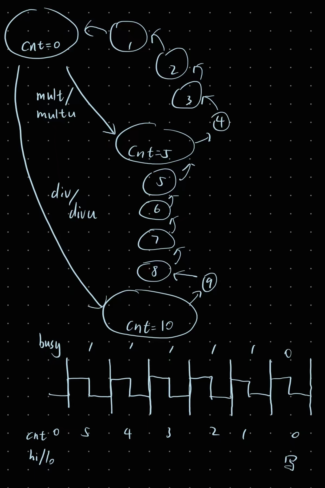
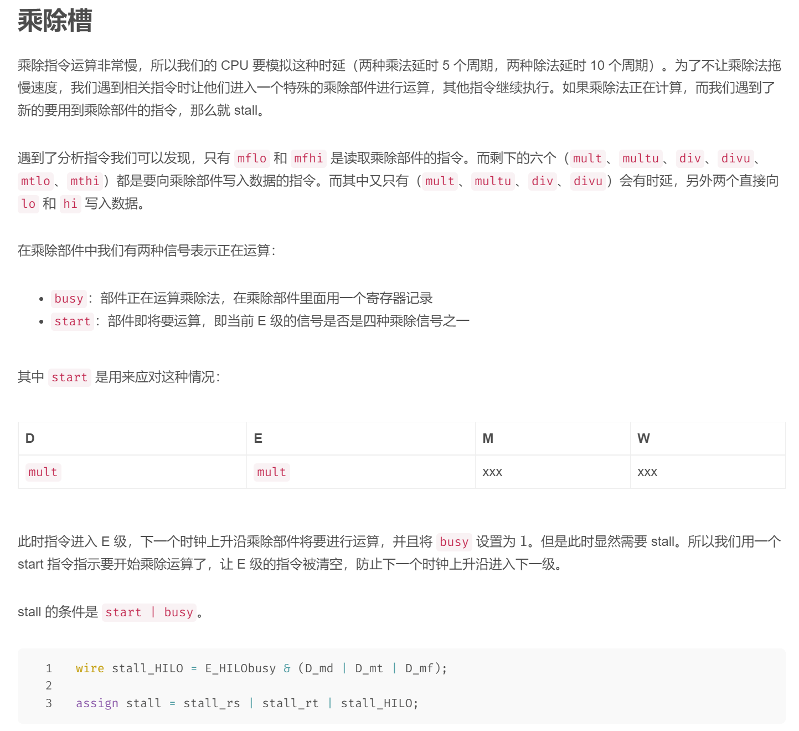
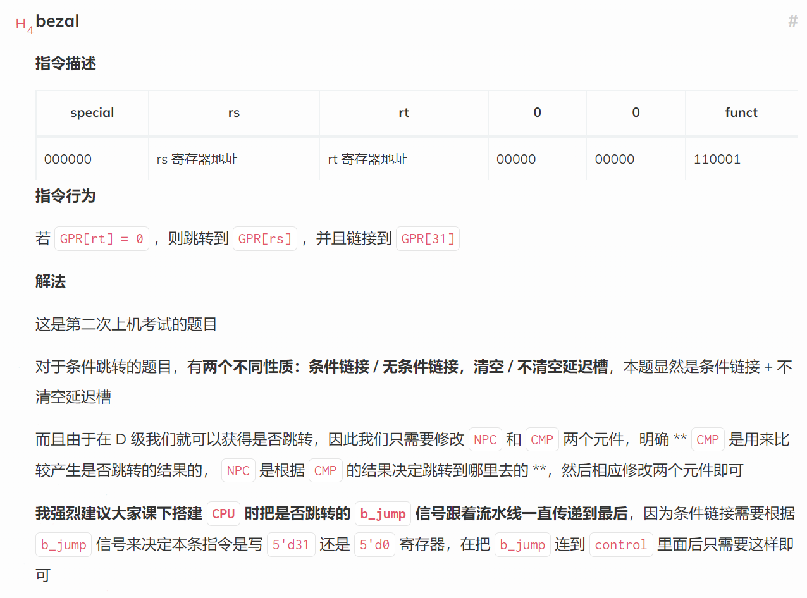
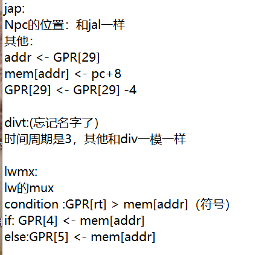
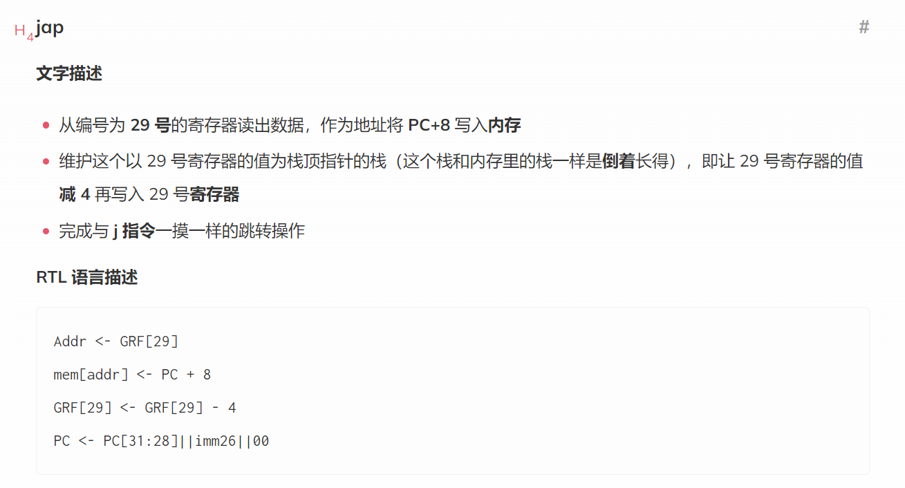
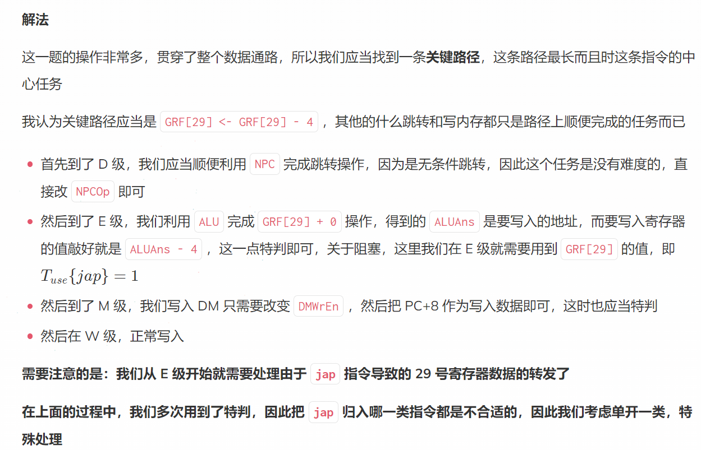
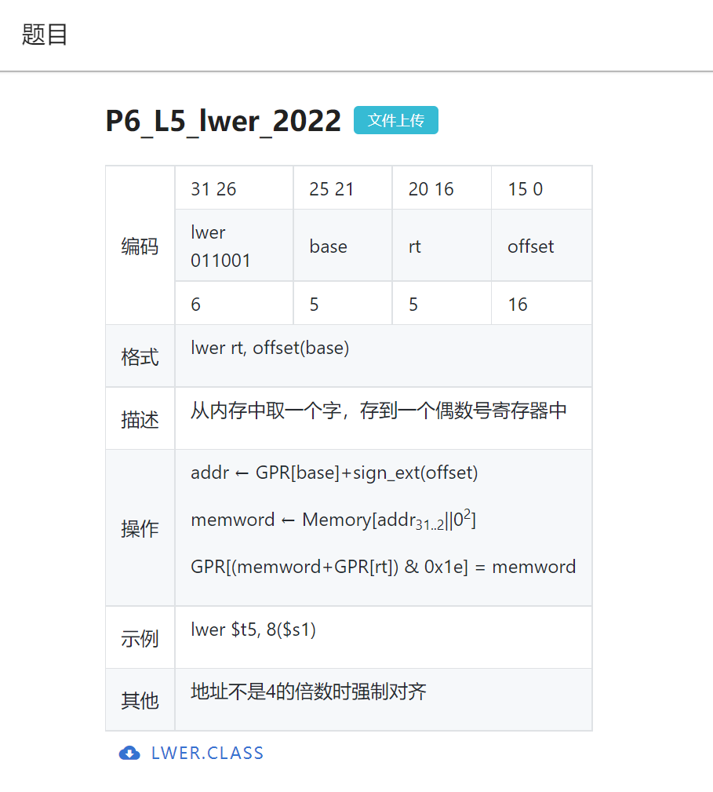

[TOC]


# CPU设计文档 P6

## 设计要求

### 作业概括

本次实验是在 P5 对流水线 CPU 设计了解的基础上，设计一个支持更多指令的较为复杂的流水线 CPU。考察同学们对流水线原理的掌握和对复杂系统的设计实现能力。

### 设计说明

处理器应为五级流水线设计，支持如下指令集：

```mipsasm
add, sub, and, or, slt, sltu, lui
addi, andi, ori
lb, lh, lw, sb, sh, sw
mult, multu, div, divu, mfhi, mflo, mthi, mtlo
beq, bne, jal, jr
```

再加上nop，共29条。

请注意，所有运算类指令均暂不考虑因溢出而产生的异常。

### 设计要求

1. 直接通过顶层模块 mips.v 的 output 端口传出相应信号，不允许出现 `display` 语句，具体要求见“在线测试相关说明”小节。
2. 要求存储器外置，即将 IM 和 DM 放置在 CPU 之外。P6 的 IM 和 DM 两个模块被内置于官方评测的 testbench 中（官方使用的 tb 已在“存储器外置”小节公开），**不再需要**大家自行实现 IM 和 DM 模块。官方 tb 中实现的指令存储器（IM，instruction memory）和数据存储器（DM，data memory）的容量如下：
   - IM：容量为 **16KB** (32bit/word × **4096word**)
   - DM：容量为 **12KB** (32bit/word × **3072word**)
3. 需有单独的**乘除法模块**和**数据扩展模块**，我们会分别在“乘除模块”和“支持按字节访存”两个小节中中予以详细说明。
4. 最外层的 mips 模块的文件名必须为 mips.v ，该文件中的 module 也必须命名为 **mips** 。

### 测试要求

1. 你编写的汇编测试程序必须确保所有指令都被测试充分（对于指令功能的测试，可参考 P3 测试部分的教程）。
2. 冲突（冒险）是你的测试重点，你的测试程序必须去充分地测试数据冲突和分支（控制）冲突，对可能会产生冲突的各种指令的组合都要考虑到（对于暂停转发的测试，可参考 P5 测试部分的教程）。
3. 如果你仔细思考就会发现，上述冲突的覆盖性分析与流水线的设计其实是相互促进的。你的测试用例集是根据你的流水线设计构造的，而你的流水线设计又可以根据测试用例集进行完善。

## 指令分类

加粗的是p6相比p5新增的指令。

p5实现10条，p6新增19条，共29条。

- cali 寄存器立即数计算：**addi**, **andi**, ori
- calr 寄存器寄存器计算：add, sub, **slt, sltu, and, or**
- branch 根据寄存器分支：beq, **bne**
- store 写内存：sw, **sh, sb**
- load 读内存：lw, **lh, lb**
- 读乘除法寄存器：**mfhi, mflo**
- 写乘除法寄存器：**mthi, mtlo, mult, multu, div, div**
- jal 跳转并链接：jal
- jr 跳转寄存器：jr
- lui 加载高位：lui
- 空指令：nop

| 大类   | 小类   | 含义                              | 指令                             |
| ------ | ------ | --------------------------------- | -------------------------------- |
| PC     | jal    | 跳转并链接                        | jal                              |
| EXT    | lui    | 加载高位                          | lui                              |
| ALU    | calr   | 寄存器寄存器计算                  | add, sub, **slt, sltu, and, or** |
| ALU    | cali   | 寄存器立即数计算                  | **addi**, **andi**, ori          |
| DM     | load   | 读内存                            | lw, **lh, lb**                   |
| 不产生 | store  | 写内存                            | sw, **sh, sb**                   |
| 不产生 | jr     | 跳转寄存器                        | jr                               |
| 不产生 | branch | 根据寄存器分支                    | beq, **bne**                     |
| -      | -      | 空指令                            | nop                              |
|        | mf     | 读hi/lo寄存器，写GRF[rd]          | **mfhi, mflo**                   |
|        | mt     | 读GRF[rs]，写hi/lo寄存器          | **mthi, mtlo**                   |
|        | md     | 读GRF[rs]和GRF[rt]，写hi/lo寄存器 | **mult, multu, div, divu**       |

大类：如果指令会产生结果（写寄存器），则以产生结果的功能部件命名；否则归类为“不产生”。

小类：更具体的指令分类，比如大类ALU包括小类calr与cali。

小类写在了const.v的宏定义。

## 流水线数据通路


## 控制信号真值表

见文件"控制单元真值表 P6.xlsx"

## 根据Tuse和Tnew构造策略矩阵和转发MUX

见文件"根据Tuse和Tnew构造策略矩阵和转发MUX P6.xlsx"

## 模块设计

### MUX

这里采用assign加三目运算符实现

分为三类：

1. 数据mux：有三个，分别用于选择ALUB，GRFA3，GRFWD
2. 转发发送mux：有三个，分别在E，M，W
3. 转发接收mux：有五个，分别是D级RD1，D级RD2，E级RD1，E级RD2，M级RD2

### CU

| 信号名         | 方向 | 描述                             |
| -------------- | ---- | -------------------------------- |
| [31:0] instr   | I    | 指令                             |
| [31:0] DMA     | I    | DM写数据地址                     |
| [4:0] rs       | O    | instr[25:21]                     |
| [4:0] rt       | O    | instr[20:16]                     |
| [4:0] rd       | O    | instr[15:11]                     |
| [15:0] imm16   | O    | instr[15:0]                      |
| [25:0] imm26   | O    | instr[25:0]                      |
| [4:0] type     | O    | 指令类型<br />见const.v          |
| [4:0] EXTOp    | O    | EXT功能选择                      |
| [4:0] NPCOp    | O    | NPC功能选择                      |
| [4:0] ALUOp    | O    | ALU功能选择                      |
| [4:0] ALUBSrc  | O    | ALUB来源选择                     |
| [4:0] MDUType  | O    | 乘除指令分类                     |
| [3:0] DMWE     | O    | 4位DM字节写使能                  |
| [4:0] DMWDType | O    | 写数据种类 sw/sh/sb              |
| [4:0] DEOp     | O    | DM读数据扩展功能                 |
| GRFWE          | O    | GRF写使能信号                    |
| [4:0] GRFA3Src | O    | 写寄存器地址选择                 |
| [4:0] GRFWDSrc | O    | 写寄存器数据选择                 |
| [4:0] GRFA3    | O    | 写寄存器地址<br />决定于指令类型 |

### SU

| 信号名         | 方向 | 描述          |
| -------------- | ---- | ------------- |
| [31:0] D_instr | I    | D级流水指令   |
| [31:0] E_instr | I    | E级流水指令   |
| [31:0] M_instr | I    | M级流水指令   |
| E_MDUstart     | I    | MDU start信号 |
| E_MDUbusy      | I    | MDU busy信号  |
| stall          | O    | 阻塞信号      |

SU中分别实例化了三个CU，用于D,E,M三个阶段的指令译码。

### F_PC

**端口说明**

| 信号名     | 方向 | 描述         |
| ---------- | ---- | ------------ |
| clk        | I    | 时钟         |
| reset      | I    | pc_reg重置   |
| PCWE       | I    | PC写使能信号 |
| [31:0] npc | I    | 下条指令地址 |
| [31:0] pc  | O    | 当前指令地址 |

### D_REG

D_REG: instr, pc

| 信号名           | 方向 | 描述             |
| ---------------- | ---- | ---------------- |
| clk              | I    | 时钟             |
| reset            | I    | 流水寄存器重置   |
| WE               | I    | 流水寄存器写使能 |
| [31:0] instr_in  | I    | 指令             |
| [31:0] pc_in     | I    | pc               |
| [31:0] instr_out | O    |                  |
| [31:0] pc_out    | O    |                  |

### D_GRF

| 信号名     | 方向 | 描述         |
| ---------- | ---- | ------------ |
| clk        | I    | 时钟         |
| reset      | I    | GRF重置      |
| WE         | I    | GRF写使能    |
| [4:0] A1   | I    | GRF读出地址1 |
| [4:0] A2   | I    | GRF读出地址2 |
| [4:0] A3   | I    | GRF写入地址  |
| [31:0] WD  | I    | GRF写入数据  |
| [31:0] RD1 | O    | GRF读出数据1 |
| [31:0] RD2 | O    | GRF读出数据2 |

### D_EXT

| 信号名       | 方向 | 描述           |
| ------------ | ---- | -------------- |
| [15:0] imm16 | I    | 16位立即数     |
| [4:0] EXTOp  | I    | EXT功能选择    |
| [31:0] EXT32 | O    | 立即数扩展结果 |

### D_NPC

**端口说明**

| 信号名       | 方向 | 描述             |
| ------------ | ---- | ---------------- |
| [4:0] NPCOp  | I    | NPC功能选择      |
| [31:0] F_pc  | I    | F段的pc          |
| [31:0] D_pc  | I    | D段的pc          |
| [25:0] imm26 | I    | 指令的26位立即数 |
| [31:0] RD1   | I    | GRF读出数据1     |
| [31:0] RD2   | I    | GRF读出数据2     |
| [31:0] npc   | O    | 下条指令地址     |

### E_REG

E_REG: instr, pc, RD1, RD2, EXT32

| 信号名           | 方向 | 描述             |
| ---------------- | ---- | ---------------- |
| clk              | I    | 时钟             |
| reset            | I    | 流水寄存器重置   |
| WE               | I    | 流水寄存器写使能 |
| [31:0] instr_in  | I    | 指令             |
| [31:0] pc_in     | I    | pc               |
| [31:0] RD1_in    | I    | GRF读出数据1     |
| [31:0] RD2_in    | I    | GRF读出数据2     |
| [31:0] EXT32_in  | I    | 立即数扩展结果   |
| [31:0] instr_out | O    |                  |
| [31:0] pc_out    | O    |                  |
| [31:0] RD1_out   | O    |                  |
| [31:0] RD2_out   | O    |                  |
| [31:0] EXT32_out | O    |                  |

### E_ALU

| 信号名      | 方向 | 描述        |
| ----------- | ---- | ----------- |
| [4:0] ALUOp | I    | ALU功能选择 |
| [31:0] A    | I    | 运算数A     |
| [31:0] B    | I    | 运算数B     |
| [31:0] AO   | O    | ALU运算结果 |

### E_MDU

| 信号名        | 方向 | 描述         |
| ------------- | ---- | ------------ |
| clk           | I    | 时钟         |
| reset         | I    | 寄存器重置   |
| [4:0] MDUType | I    | 乘除指令分类 |
| [31:0] A      | I    | 运算数A      |
| [31:0] B      | I    | 运算数B      |
| [31:0] MDUO   | O    | MDU运算结果  |
| start         | O    | start信号    |
| busy          | O    | busy信号     |

### M_REG

M_REG: instr, pc, RD2, EXT32, AO, MDUO

| 信号名           | 方向 | 描述             |
| ---------------- | ---- | ---------------- |
| clk              | I    | 时钟             |
| reset            | I    | 流水寄存器重置   |
| WE               | I    | 流水寄存器写使能 |
| [31:0] instr_in  | I    | 指令             |
| [31:0] pc_in     | I    | pc               |
| [31:0] RD2_in    | I    | GRF读出结果2     |
| [31:0] EXT32_in  | I    | 立即数扩展结果   |
| [31:0] AO_in     | I    | ALU运算结果      |
| [31:0] MDUO_in   | I    | MDU运算结果      |
| [31:0] instr_out | O    |                  |
| [31:0] pc_out    | O    |                  |
| [31:0] RD2_out   | O    |                  |
| [31:0] EXT32_out | O    |                  |
| [31:0] AO_out    | O    |                  |
| [31:0] MDUO_out  | O    |                  |

### M_DE

| 信号名        | 方向 | 描述             |
| ------------- | ---- | ---------------- |
| [31:0] DEI    | I    | DE输入           |
| [4:0] DEOp    | I    | DM读数据扩展功能 |
| [1:0] Aoffset | I    | 接入M_AO[1:0]    |
| [31:0] DEO    | O    | DE输出           |

### W_REG

W_REG:  instr, pc, EXT32, AO, RD, MDUO

| 信号名           | 方向 | 描述             |
| ---------------- | ---- | ---------------- |
| clk              | I    | 时钟             |
| reset            | I    | 流水寄存器重置   |
| WE               | I    | 流水寄存器写使能 |
| [31:0] instr_in  | I    | 指令             |
| [31:0] pc_in     | I    | pc               |
| [31:0] EXT32_in  | I    | 立即数扩展结果   |
| [31:0] AO_in     | I    | ALU运算结果      |
| [31:0] RD_in     | I    | DM读出数据       |
| [31:0] MDUO_in   | I    | MDU运算结果      |
| [31:0] instr_out | O    |                  |
| [31:0] pc_out    | O    |                  |
| [31:0] EXT32_out | O    |                  |
| [31:0] AO_out    | O    |                  |
| [31:0] RD_out    | O    |                  |
| [31:0] MDUO_out  | O    |                  |

## MDU状态图



## 乘除槽



## const.v

```verilog
//指令分类小类
`define calr 5'd0
`define cali 5'd1
`define lui 5'd2
`define load 5'd3
`define store 5'd4
`define branch 5'd5
`define jal 5'd6
`define jr 5'd7
`define mf 5'd8
`define mt 5'd9
`define md 5'd10

//GRFWDSrc
`define GRFWDSrc_AO 5'd0
`define GRFWDSrc_RD 5'd1
`define GRFWDSrc_EXT32 5'd2
`define GRFWDSrc_pc8 5'd3
`define GRFWDSrc_MDUO 5'd4

//MDUType
//读hilo
`define MDUType_mfhi 5'd0
`define MDUType_mflo 5'd1
//写hilo
`define MDUType_mthi 5'd2
`define MDUType_mtlo 5'd3
`define MDUType_mult 5'd4
`define MDUType_multu 5'd5
`define MDUType_div 5'd6
`define MDUType_divu 5'd7

//DMWDType
`define DMWDType_sw 5'd0
`define DMWDType_sh 5'd1
`define DMWDType_sb 5'd2
```


## 思考题

1. 为什么需要有单独的乘除法部件而不是整合进 ALU？为何需要有独立的 HI、LO 寄存器？

   高内聚低耦合。

   流水线效率角度：如果乘除法部件整合进ALU，乘除法延迟的时间内，其他需要使用ALU的指令无法执行而被阻塞，效率降低。

   寄存器用途角度：HI、LO寄存器的用途非常单一，并不通用，所以不使用通用寄存器作为保存乘除法运算结果的寄存器是合理的。

2. 真实的流水线 CPU 是如何使用实现乘除法的？请查阅相关资料进行简单说明。

   流水线是在[组合逻辑](https://www.zhihu.com/search?q=组合逻辑&search_source=Entity&hybrid_search_source=Entity&hybrid_search_extra={"sourceType"%3A"answer"%2C"sourceId"%3A"78097049"})上插入寄存器进行分割，所以插入流水线步骤如下：

   1. 画出所要实现的逻辑的[组合逻辑电路图](https://www.zhihu.com/search?q=组合逻辑电路图&search_source=Entity&hybrid_search_source=Entity&hybrid_search_extra={"sourceType"%3A"answer"%2C"sourceId"%3A"78097049"})；
   2. 找出所要实现电路的关键路径(延时最长的路径);
   3. 对[关键路径](https://www.zhihu.com/search?q=关键路径&search_source=Entity&hybrid_search_source=Entity&hybrid_search_extra={"sourceType"%3A"answer"%2C"sourceId"%3A"78097049"})进行分割，即画框将对应的电路图进行分割，注意要将所有的输入或输出包在框中；
   4. 框图与电路图相交的地方做出标记，相交的地方需要插入[寄存器](https://www.zhihu.com/search?q=寄存器&search_source=Entity&hybrid_search_source=Entity&hybrid_search_extra={"sourceType"%3A"answer"%2C"sourceId"%3A"78097049"})；
   5. 写代码进行硬件实现；
   6. 结束，插入流水线完成。

   插入流水线操作如下图：

   

   

   对[乘法器](https://www.zhihu.com/search?q=乘法器&search_source=Entity&hybrid_search_source=Entity&hybrid_search_extra={"sourceType"%3A"answer"%2C"sourceId"%3A"78097049"})插入流水线如下图所示：

   插入流水线前的纯组合逻辑乘法器电路：

   

   在组合逻辑中插入流水线，其中红线就是流水线分割的框图

   

   【参考资料】

   怎么设计流水线乘除运算器？ - young cc的回答 - 知乎 https://www.zhihu.com/question/38174591/answer/78097049

3. 请结合自己的实现分析，你是如何处理 Busy 信号带来的周期阻塞的？

   本质上是构造了一个多状态的有限状态机，按照需要阻塞的周期数进行状态的转移。

4. 请问采用字节使能信号的方式处理写指令有什么好处？（提示：从清晰性、统一性等角度考虑）

   可以直接从四位字节使能信号的值看出存取的数据位，代码更具易读性。

   使用字节使能信号，将按字、按半字、按字节存取这些操作统一为对不同字节的控制。

5. 请思考，我们在按字节读和按字节写时，实际从 DM 获得的数据和向 DM 写入的数据是否是一字节？在什么情况下我们按字节读和按字节写的效率会高于按字读和按字写呢？

   不是，是一个字。需要在不连续的地址多次按字节读写时，效率会高于按字读写。

6. 为了对抗复杂性你采取了哪些抽象和规范手段？这些手段在译码和处理数据冲突的时候有什么样的特点与帮助？

   手段：将功能部件模块化，对指令进行分类，使用宏定义，等等。

   在译码和处理数据冲突阶段时，由于进行了指令分类和采用了**控制信号驱动型**的译码器等，使得添加新指令的流程变得相对简洁和规范，不增加额外的复杂性。

7. 在本实验中你遇到了哪些不同指令类型组合产生的冲突？你又是如何解决的？相应的测试样例是什么样的？

   P6相比P5新增的指令分类有mf，mt，md，其中mf读hi/lo寄存器，写GRF[rd]；mt读GRF[rs]，写hi/lo寄存器；md读GRF[rs]和GRF[rt]，写hi/lo寄存器。

   新的冲突，由mf写寄存器和mt，md读寄存器造成。

   解决办法是，分析Tnew和Tuse，使用AT法解决。

   测试样例见文件。

8. 如果你是手动构造的样例，请说明构造策略，说明你的测试程序如何保证**覆盖**了所有需要测试的情况；如果你是**完全随机**生成的测试样例，请思考完全随机的测试程序有何不足之处；如果你在生成测试样例时采用了**特殊的策略**，比如构造连续数据冒险序列，请你描述一下你使用的策略如何**结合了随机性**达到强测的效果。

   手动构造，在p5测试数据的基础上，新增p6的指令，方法基本一致。构造指令序列时以枚举两条相关的指令单位为主，以枚举四条连续的指令单位为辅。

9. [P5、P6 选做] 请评估我们给出的覆盖率分析模型的合理性，如有更好的方案，可一并提出。

## 往年题

### a 分析

跳转和存储没什么好说的，都在 P5 里面说过了。所以这里说一下 P6 的计算。

P6 的计算一般是和乘除部件有关，但是其实也不难，这里建议课下做一下 `madd`、`maddu`、`msub`、`msubu`。

一个坑点在于 `madd`（或者 `msub`）里面。如果你的写法是

```verilog
{temp_hi, temp_lo} <= {hi, lo} + $signed(rs) * $signed(rt);
```

好像就会出锅，这个具体的原因在 P1 里面讲过了，和 signedness 有关。另外，如果你写的是

```verilog
{temp_hi, temp_lo} <= {hi, lo} + $signed($signed(rs) * $signed(rt));
```

也不对，具体也是 P1 里面有讲。正确的写法是：

```verilog
{temp_hi, temp_lo} <= {hi, lo} + $signed($signed(64'd0) + $signed(rs) * $signed(rt));
// 或者
{temp_hi, temp_lo} <= {hi, lo} + $signed({{32{rs[31]}}, rs[31]} * $signed({{32{rt[31]}}, rt[31]})); // 手动进行符号位扩展
```

总之一句话：小心 `$signed()`。

课上可能会出现 `Your CPU runs less cycles than expected.` 这种情况可以适当加一下乘除部件的 busy 时间。


注：其实可以写

```verilog
{temp_hi, temp_lo} <= $signed({hi, lo}) + $signed(rs) * $signed(rt);
```

### b P6课上回忆

相信大家都看了很多博客，也知道了课上大概率会考啥。  
就是一道跳转，一道MDU，还有一道DM的条件写。

有幸挂了一次，所以能为大家带来两次的题目 : )

第一次的题目见这里-->[P6准备](https://github.com/rfhits/Computer-Organization-BUAA-2020/blob/main/8-P6/P6%E5%87%86%E5%A4%87.md)

#### bgezalr

|   op   |  rs  |  rt  |  rd  | nothing | funct  |
| :----: | :--: | :--: | :--: | :-----: | :----: |
| 111111 |  rs  |  rt  |  rd  |  00000  | 000000 |

不保证课上指令的op和funct和此一致哈

描述：

    GRF[rd] <= PC + 8 
    condition = (GRF[rs] >= 0)
    if condition :
        PC <= GRF[rt]

无条件写，有条件跳

我提交了两次，因为这个指令和jalr不一样，  
我想当然了——以为都用GRF[rs]里的值作为NPC，  
结果，跳飞了，，跳到比3000还前面的空间  
人都傻了

然后看了以下自己画的CPU，检查数据通路，才发现bgezalr用的是GRF[rt]

接下来就是增加NPC功能，提供GRF[rt]的跳转

捡回一条小命。。。
    

#### MSUB

千万不要以为

    {HI, LO} = {HI, LO} - $signed(A) × $signed(B)

这样就够了。  
本来以为这题交了就过了，没想到，，失算了。

这条指令的坑在于signed，保险起见，我课上加的是：

    {HI, LO} = $signed($signed({HI, LO}) - $signed(A) × $signed(B))

#### lhs

|   op   |  rs  |  rt  | offset |
| :----: | :--: | :--: | :----: |
| 011011 |  rs  |  rd  | offset |

不保证课上指令的op和此一致哈

条件写是毒瘤

这条指令和lh的差别在于：

    byte = addr[1:0]
    if((byte == 0) || (byte == 2)):
        GRF[rt] <= MemWord
    else:
        pass

注意当条件不成立时，不可向GRF[rt]写原值，测评机没那么智能：  
测评机不知道GRF里有什么，更不知道addr后两位是什么，  
所以没法忽略写原值  
只会拿Mars的结果和代码运行结果比较。

---

使用TnewTuse架构的同学可以跳过这段。

如果采用的是“Use-Stall”的方法（就是Kxh学长的架构），  
那么要进行改进：  
不可将A3在流水线寄存器间相连，而是要经过各个组合逻辑。  
A3的流水情况和WriteData一致。  
在D-Stage，译码出A3可以置为5'z，  
在M-Stage，要对A3处理，如果是lhs指令，根据条件改变A3为rt或0

暂停逻辑:  
如果(A3E===5'bz)，StallD被置1（当然优先级还是低于StallE），任何指令都要被堵在D级前；  
如果(A3M===5'bz)，StallE被置1，任何指令都要被堵在E级前。

---

#### 结语

大家只要埋伏一手，注意避坑就好。

### c  课上部分

#### 第一类：运算类

##### shl (swap HI LO)

这是第一次课上考试的题目，要求是交换 HI、LO 寄存器的值 

可以直接这样加（注意非阻塞赋值的运用），非常容易

```verilog
if(MDUOp == `MDU_shl) begin
    HI <= LO;
    LO <= HI;
end
```

##### bds (big divide(unsigned) small) 

给出 rs 和 rt 两个寄存器，用较大的那个数除以较小的那个数，注意是无符号除法 

这是第二次课上考试的题目，也非常容易（注意无符号）

```verilog
if(MDUOp == `MDU_bds) begin
    if(D1 > D2) begin
        tmp_LO <= D1 / D2;
        tmp_HI <= D1 % D2;
    end else begin
        tmp_LO <= D2 / D1;
        tmp_HI <= D2 % D1;  
    end
end
```

可以看出主要是关于乘除槽的计算，只要熟悉乘除槽的工作原理，第一题不难做出

#### 第二类：条件跳转

##### bezal



```verilog
	// 要向寄存器中写入的值
assign GRFWDSel = (jump_link | branch_link) ? `WDSel_pc8 :
                  (load) ? `WDSel_dmrd :
                  (mf) ? `WDSel_mduans :
                  `WDSel_aluans;
// 要写入哪个寄存器
assign GRFA3 = (calc_r | jalr | mf) ? rd :
               (calc_i | load) ? rt :
    		   (jal | (branch_link && b_jump)) ? 5'd31 :		// 仅限条件链接
               5'd0;
```

对于清空延迟槽，P5 已经说过了，要注意在处于阻塞状态时不能立即清空延迟槽指令，因为这时候你得到的 b_jump 未必是正确的，代码如下：

```verilog
// D_CMP.v
assign flush = (CMPOp == `CMP_bltzall && !jump);
// mips.v
assign FD_REG_Flush = CMP_flush && !Stall;
```

对于本题而言，跳转方式反而与 jr, jalr 类似，但是还是需要 CMP 的判断，因此考虑给 NPC 和 CMP 都添加新的控制信号，然后 CMP 按 rtData < 0 比较，NPC 按 jr 跳转，就可以轻松解决本题

### d

#### jap

在CU中判断如果指令是jap，rt就为29；ALU算GPR[29]-4(rt_data-4)，寄存器存ALU结果就可以了，实际上和r指令i指令没啥区别







## 易错点

注意是有符号还是无符号乘除

注意有符号数的处理

## p6课上总结

### 第一题 jabs

类似于beq，但是慌乱中忘记修改SU添加jabs的tuse，耽误了时间

### 第二题 shl

交换hi和lo寄存器。看似人畜无害，实则是最阴间的指令。

前面的数据点均通过，但最后一个数据点，提示too few outputs，看同学在群里讨论，发现其实竟然是tle的问题，这谁想得到？

**为什么会tle？**

最先想到的，也就是会tle的写法是这样的：

```verilog
    wire stall_MDU = (E_MDUstart | E_MDUbusy) & 
        (D_type==`mf | D_type==`mt | D_type==`md | D_type==`new);

    assign stall = stall_rs | stall_rt | stall_MDU;
```

新添加的 | D_type==`new 影响原来周期数的唯一原因：如果E级下个周期要进行乘除运算(start)，或正在进行乘除运算(busy)，如果遇到D级是shl指令，则阻塞，直到算完。

正是这一与mf、mt、md相同的阻塞策略，却造成了TLE的结果。表明测试数据是比较阴间的。

**如何解决tle？**我们要想办法要避免对shl的阻塞。

也就是说，我们要寻找和**“如果E级下个周期要进行乘除运算(start)，或正在进行乘除运算(busy)，如果遇到D级是shl指令，则阻塞，直到算完”的不用阻塞的，最后hi,lo寄存器结果完全相同的一个等价处理方法。**这个方法如下：

```verilog
    wire stall_MDU = (E_MDUstart | E_MDUbusy) & 
		(D_type==`mf | D_type==`mt | D_type==`md);	//不添加 | D_type==`new

    assign stall = stall_rs | stall_rt | stall_MDU;
```

首先，不修改SU，即**不阻塞新加的shl指令**。

然后，在一条乘除指令正在进行乘除运算(busy)的周期内，**计数D级为shl指令的出现周期数，也就是在乘除运算时，我们交换了多少次的hi和lo寄存器**。若这个数为**奇数**，则hi和lo需要**在乘除运算完毕后，进行一次交换**，若为**偶数**，则hi和lo**不需交换**。

这样就不用阻塞shl。

### 第三题 lwer



lwer指令，忙中出错：

CU.v中没想清楚数据通路，给新指令选择了新的DEOp，其实不用，应该和lw用一样的。

mips.v中M_newadd声明时写成了六位。

SU中的阻塞，阻塞了会读非0号寄存器的D级指令，过于无脑，可能会TLE，应该只阻塞D级指令读**偶数**寄存器的情况。如下。

```verilog
    wire E_stall_rs = (E_tnew > rs_tuse) && D_rs && ((E_type==`new)? D_rs[0]==1'b0: D_rs == E_GRFA3);
    wire M_stall_rs = (M_tnew > rs_tuse) && D_rs && ((M_type==`new)? D_rs[0]==1'b0: D_rs == M_GRFA3);
    wire E_stall_rt = (E_tnew > rt_tuse) && D_rt && ((E_type==`new)? D_rt[0]==1'b0: D_rt == E_GRFA3);
    wire M_stall_rt = (M_tnew > rt_tuse) && D_rt && ((M_type==`new)? D_rt[0]==1'b0: D_rt == M_GRFA3);
```

