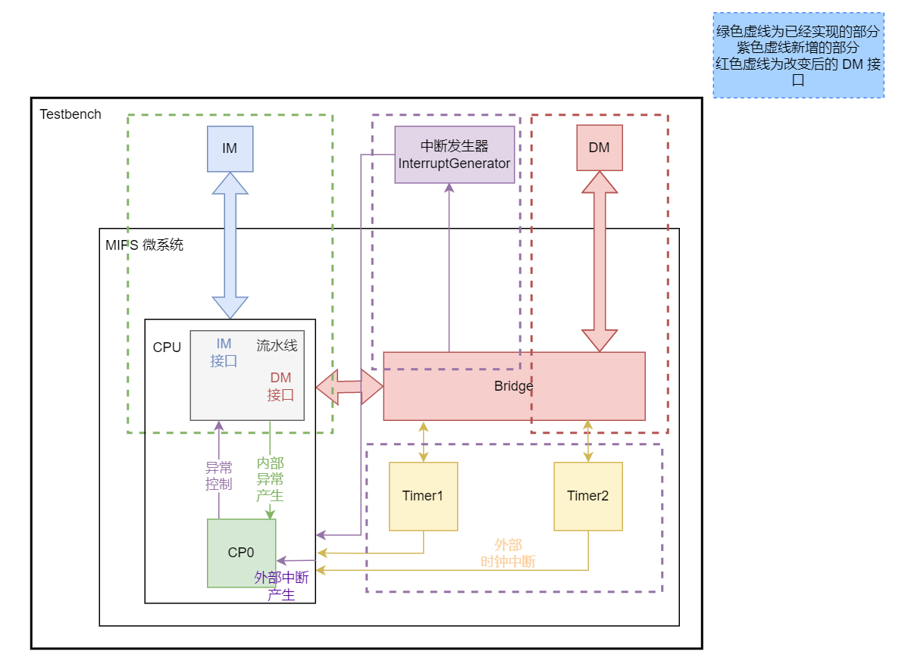
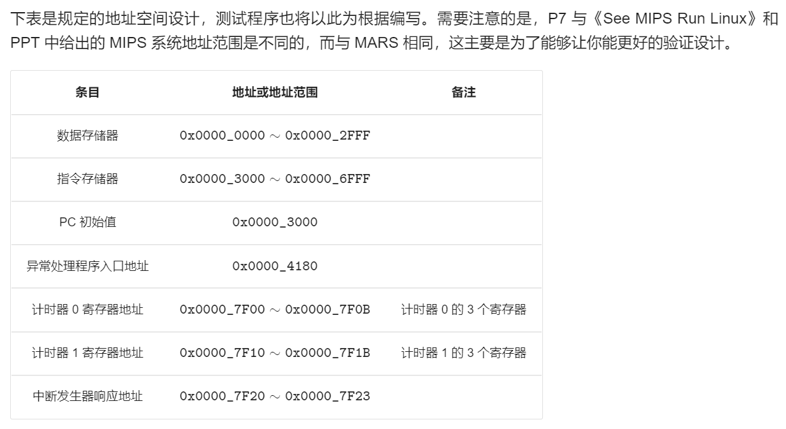
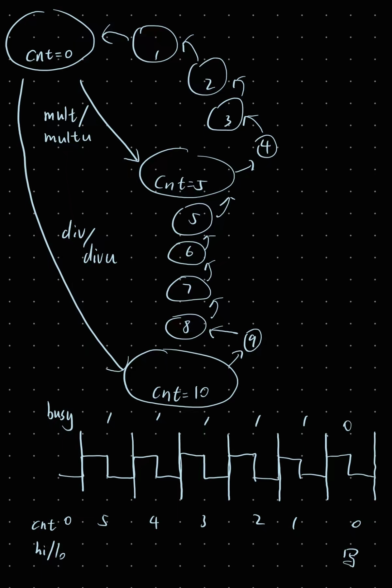
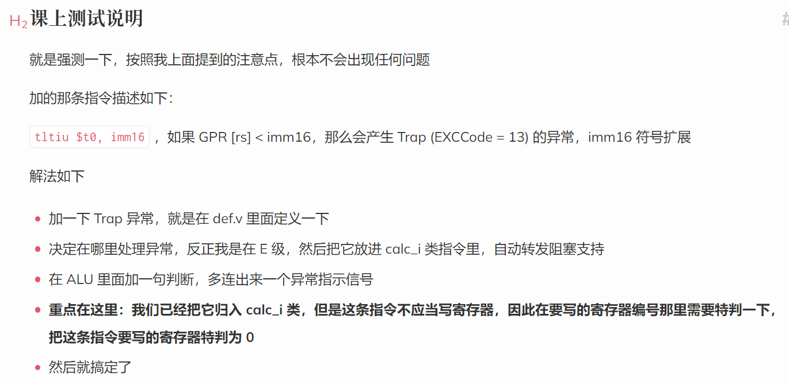
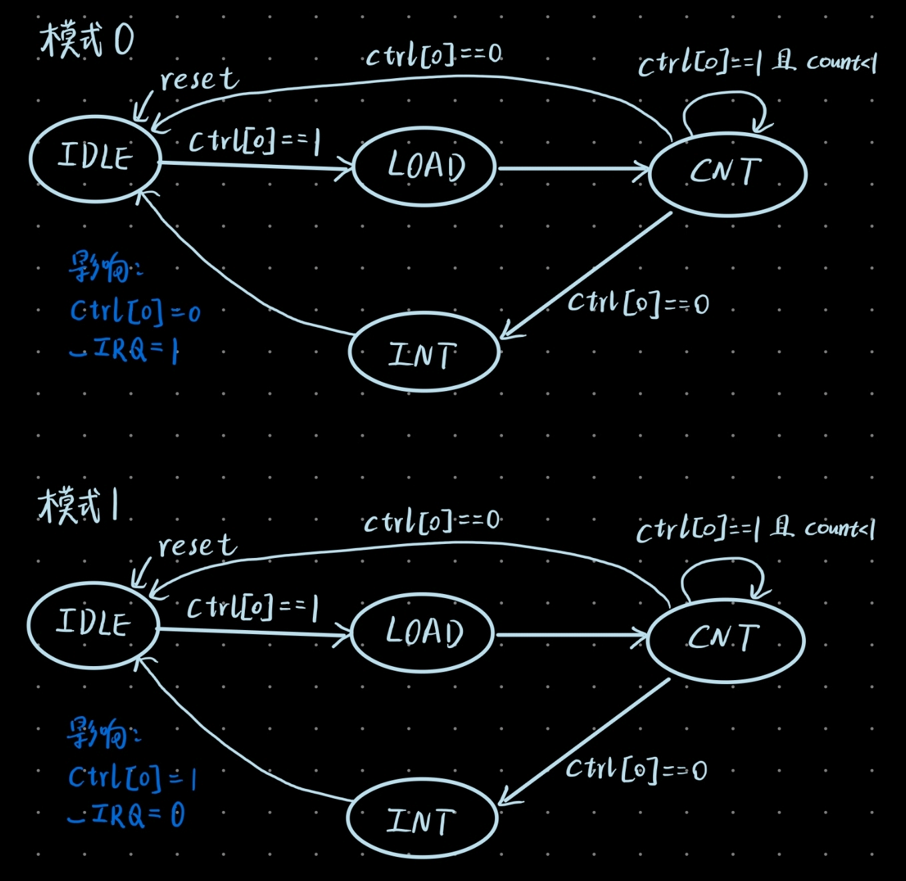
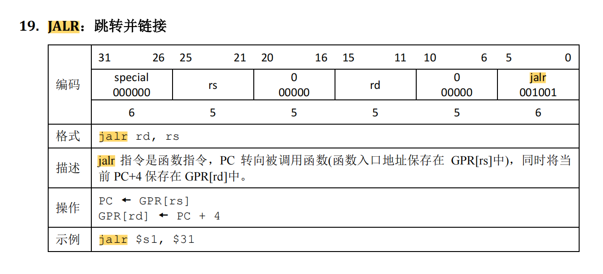

[TOC]


# CPU设计文档 P7

## 任务清单

P7 与之前的 project 相比，涉及的内容较多，所以在实现的时候很容易手忙脚乱，这里列出完成 P7 需要的事宜：

| 任务               | 解释                                                         |
| :----------------- | :----------------------------------------------------------- |
| 计时器             | 课程组提供实现代码，只需要结合代码和文档理解应用即可。       |
| 系统桥             | 为 CPU 提供统一的访问外设的接口，需要按规格自行实现。        |
| 协处理器 CP0       | 设置 CPU 的异常处理功能，反馈 CPU 的异常信息，需要按规格自行实现。 |
| 内部异常检测与流水 | CPU 需要具有可以检测内部指令执行错误的能力。                 |
| 外部中断响应       | CPU 需要具有初步响应外部中断信号的能力。                     |
| 异常处理指令       | 在异常处理程序中，会有一些特殊的指令需要实现。               |
| 单周期 CPU 的封装  | 让 CPU 从外部看上去是一个单周期 CPU。                        |
| 异常处理程序       | 利用 MARS 编写简单的异常处理程序用于测试。                   |

## 架构图



## 地址空间



## 异常码

MIPS 微系统需要支持的异常：

| ExcCode | 助记符  | 描述                                             |
| :------ | :------ | :----------------------------------------------- |
| 0       | Int     | 中断。                                           |
| 4       | AdEL    | 取数或取指时地址错误。                           |
| 5       | AdES    | 存数时地址错误。                                 |
| 8       | Syscall | 系统调用。                                       |
| 10      | RI      | 不认识的（或者非法的）指令码。                   |
| 12      | Ov      | 自陷形式的整数算术指令（例如 `add`）导致的溢出。 |

| 异常与中断码 | 助记符与名称           | 指令与指令类型       | 描述                                                |
| :----------- | :--------------------- | :------------------- | :-------------------------------------------------- |
| 0            | `Int` （外部中断）     | 所有指令             | 中断请求，来源于计时器与外部中断。                  |
| 4            | `AdEL` （取指异常）    | 所有指令             | PC 地址未字对齐。                                   |
|              |                        |                      | PC 地址超过 `0x3000 ~ 0x6ffc`。                     |
|              | `AdEL` （取数异常）    | `lw`                 | 取数地址未与 4 字节对齐。                           |
|              |                        | `lh`                 | 取数地址未与 2 字节对齐。                           |
|              |                        | `lh`, `lb`           | 取 Timer 寄存器的值。                               |
|              |                        | load 型指令          | 计算地址时加法溢出。                                |
|              |                        | load 型指令          | 取数地址超出 DM、Timer0、Timer1、中断发生器的范围。 |
| 5            | `AdES` （存数异常）    | `sw`                 | 存数地址未 4 字节对齐。                             |
|              |                        | `sh`                 | 存数地址未 2 字节对齐。                             |
|              |                        | `sh`, `sb`           | 存 Timer 寄存器的值。                               |
|              |                        | store 型指令         | 计算地址加法溢出。                                  |
|              |                        | store 型指令         | 向计时器的 Count 寄存器存值。                       |
|              |                        | store 型指令         | 存数地址超出 DM、Timer0、Timer1、中断发生器的范围。 |
| 8            | `Syscall` （系统调用） | `syscall`            | 系统调用。                                          |
| 10           | `RI`（未知指令）       | -                    | 未知的指令码。                                      |
| 12           | `Ov`（溢出异常）       | `add`, `addi`, `sub` | 算术溢出。                                          |

## 指令分类

| 大类   | 小类   | 含义                              | 指令                         |
| ------ | ------ | --------------------------------- | ---------------------------- |
| PC     | jal    | 跳转并链接                        | jal                          |
| EXT    | lui    | 加载高位                          | lui                          |
| ALU    | calr   | 寄存器寄存器计算                  | add, sub, slt, sltu, and, or |
| ALU    | cali   | 寄存器立即数计算                  | addi, andi, ori              |
| DM     | load   | 读内存                            | lw, lh, lb                   |
| 不产生 | store  | 写内存                            | sw, sh, sb                   |
| 不产生 | jr     | 跳转寄存器                        | jr                           |
| 不产生 | branch | 根据寄存器分支                    | beq, bne                     |
| -      | -      | 空指令                            | nop                          |
| MDU    | mf     | 读hi/lo寄存器，写GRF[rd]          | mfhi, mflo                   |
| 不产生 | mt     | 读GRF[rs]，写hi/lo寄存器          | mthi, mtlo                   |
| 不产生 | md     | 读GRF[rs]和GRF[rt]，写hi/lo寄存器 | mult, multu, div, divu       |
| CP0    | mfc0   | GPR[rt] <- CP0[rd]                | mfc0                         |
| 不产生 | mtc0   | CP0[rd] <- GPR[rt]                | mtc0                         |
| -      | -      | 产生异常并进入内核态              | syscall                      |

## 流水线数据通路


## 控制单元真值表

见文件

## 根据Tuse和Tnew构造策略矩阵和转发MUX

见文件

## 模块设计

### MUX

这里采用assign加三目运算符实现

分为三类：

1. 数据mux：有三个，分别用于选择ALUB，GRFA3，GRFWD
2. 转发发送mux：有三个，分别在E，M，W
3. 转发接收mux：有五个，分别是D级RD1，D级RD2，E级RD1，E级RD2，M级RD2

### CU

| 信号名         | 方向 | 描述                             |
| -------------- | ---- | -------------------------------- |
| [31:0] instr   | I    | 指令                             |
| [31:0] DMA     | I    | DM写数据地址                     |
| [4:0] rs       | O    | instr[25:21]                     |
| [4:0] rt       | O    | instr[20:16]                     |
| [4:0] rd       | O    | instr[15:11]                     |
| [15:0] imm16   | O    | instr[15:0]                      |
| [25:0] imm26   | O    | instr[25:0]                      |
| [4:0] type     | O    | 指令类型<br />见const.v          |
| [4:0] EXTOp    | O    | EXT功能选择                      |
| [4:0] NPCOp    | O    | NPC功能选择                      |
| [4:0] ALUOp    | O    | ALU功能选择                      |
| [4:0] ALUBSrc  | O    | ALUB来源选择                     |
| [4:0] MDUType  | O    | 乘除指令分类                     |
| [3:0] DMWE     | O    | 4位DM字节写使能                  |
| [4:0] DMWDType | O    | 写数据种类 sw/sh/sb              |
| [4:0] DEOp     | O    | DM读数据扩展功能                 |
| GRFWE          | O    | GRF写使能信号                    |
| [4:0] GRFA3Src | O    | 写寄存器地址选择                 |
| [4:0] GRFWDSrc | O    | 写寄存器数据选择                 |
| [4:0] GRFA3    | O    | 写寄存器地址<br />决定于指令类型 |

### SU

| 信号名         | 方向 | 描述          |
| -------------- | ---- | ------------- |
| [31:0] D_instr | I    | D级流水指令   |
| [31:0] E_instr | I    | E级流水指令   |
| [31:0] M_instr | I    | M级流水指令   |
| E_MDUstart     | I    | MDU start信号 |
| E_MDUbusy      | I    | MDU busy信号  |
| stall          | O    | 阻塞信号      |

SU中分别实例化了三个CU，用于D,E,M三个阶段的指令译码。

### F_PC

**端口说明**

| 信号名     | 方向 | 描述         |
| ---------- | ---- | ------------ |
| clk        | I    | 时钟         |
| reset      | I    | pc_reg重置   |
| PCWE       | I    | PC写使能信号 |
| [31:0] npc | I    | 下条指令地址 |
| [31:0] pc  | O    | 当前指令地址 |

### D_REG

D_REG: instr, pc

| 信号名           | 方向 | 描述             |
| ---------------- | ---- | ---------------- |
| clk              | I    | 时钟             |
| reset            | I    | 流水寄存器重置   |
| WE               | I    | 流水寄存器写使能 |
| [31:0] instr_in  | I    | 指令             |
| [31:0] pc_in     | I    | pc               |
| [31:0] instr_out | O    |                  |
| [31:0] pc_out    | O    |                  |

### D_GRF

| 信号名     | 方向 | 描述         |
| ---------- | ---- | ------------ |
| clk        | I    | 时钟         |
| reset      | I    | GRF重置      |
| WE         | I    | GRF写使能    |
| [4:0] A1   | I    | GRF读出地址1 |
| [4:0] A2   | I    | GRF读出地址2 |
| [4:0] A3   | I    | GRF写入地址  |
| [31:0] WD  | I    | GRF写入数据  |
| [31:0] RD1 | O    | GRF读出数据1 |
| [31:0] RD2 | O    | GRF读出数据2 |

### D_EXT

| 信号名       | 方向 | 描述           |
| ------------ | ---- | -------------- |
| [15:0] imm16 | I    | 16位立即数     |
| [4:0] EXTOp  | I    | EXT功能选择    |
| [31:0] EXT32 | O    | 立即数扩展结果 |

### D_NPC

**端口说明**

| 信号名       | 方向 | 描述             |
| ------------ | ---- | ---------------- |
| [4:0] NPCOp  | I    | NPC功能选择      |
| [31:0] F_pc  | I    | F段的pc          |
| [31:0] D_pc  | I    | D段的pc          |
| [25:0] imm26 | I    | 指令的26位立即数 |
| [31:0] RD1   | I    | GRF读出数据1     |
| [31:0] RD2   | I    | GRF读出数据2     |
| [31:0] npc   | O    | 下条指令地址     |

### E_REG

E_REG: instr, pc, RD1, RD2, EXT32

| 信号名           | 方向 | 描述             |
| ---------------- | ---- | ---------------- |
| clk              | I    | 时钟             |
| reset            | I    | 流水寄存器重置   |
| WE               | I    | 流水寄存器写使能 |
| [31:0] instr_in  | I    | 指令             |
| [31:0] pc_in     | I    | pc               |
| [31:0] RD1_in    | I    | GRF读出数据1     |
| [31:0] RD2_in    | I    | GRF读出数据2     |
| [31:0] EXT32_in  | I    | 立即数扩展结果   |
| [31:0] instr_out | O    |                  |
| [31:0] pc_out    | O    |                  |
| [31:0] RD1_out   | O    |                  |
| [31:0] RD2_out   | O    |                  |
| [31:0] EXT32_out | O    |                  |

### E_ALU

| 信号名      | 方向 | 描述        |
| ----------- | ---- | ----------- |
| [4:0] ALUOp | I    | ALU功能选择 |
| [31:0] A    | I    | 运算数A     |
| [31:0] B    | I    | 运算数B     |
| [31:0] AO   | O    | ALU运算结果 |

### E_MDU

| 信号名        | 方向 | 描述         |
| ------------- | ---- | ------------ |
| clk           | I    | 时钟         |
| reset         | I    | 寄存器重置   |
| [4:0] MDUType | I    | 乘除指令分类 |
| [31:0] A      | I    | 运算数A      |
| [31:0] B      | I    | 运算数B      |
| [31:0] MDUO   | O    | MDU运算结果  |
| start         | O    | start信号    |
| busy          | O    | busy信号     |

### M_REG

M_REG: instr, pc, RD2, EXT32, AO, MDUO

| 信号名           | 方向 | 描述             |
| ---------------- | ---- | ---------------- |
| clk              | I    | 时钟             |
| reset            | I    | 流水寄存器重置   |
| WE               | I    | 流水寄存器写使能 |
| [31:0] instr_in  | I    | 指令             |
| [31:0] pc_in     | I    | pc               |
| [31:0] RD2_in    | I    | GRF读出结果2     |
| [31:0] EXT32_in  | I    | 立即数扩展结果   |
| [31:0] AO_in     | I    | ALU运算结果      |
| [31:0] MDUO_in   | I    | MDU运算结果      |
| [31:0] instr_out | O    |                  |
| [31:0] pc_out    | O    |                  |
| [31:0] RD2_out   | O    |                  |
| [31:0] EXT32_out | O    |                  |
| [31:0] AO_out    | O    |                  |
| [31:0] MDUO_out  | O    |                  |

### M_DE

| 信号名        | 方向 | 描述             |
| ------------- | ---- | ---------------- |
| [31:0] DEI    | I    | DE输入           |
| [4:0] DEOp    | I    | DM读数据扩展功能 |
| [1:0] Aoffset | I    | 接入M_AO[1:0]    |
| [31:0] DEO    | O    | DE输出           |

### W_REG

W_REG:  instr, pc, EXT32, AO, RD, MDUO

| 信号名           | 方向 | 描述             |
| ---------------- | ---- | ---------------- |
| clk              | I    | 时钟             |
| reset            | I    | 流水寄存器重置   |
| WE               | I    | 流水寄存器写使能 |
| [31:0] instr_in  | I    | 指令             |
| [31:0] pc_in     | I    | pc               |
| [31:0] EXT32_in  | I    | 立即数扩展结果   |
| [31:0] AO_in     | I    | ALU运算结果      |
| [31:0] RD_in     | I    | DM读出数据       |
| [31:0] MDUO_in   | I    | MDU运算结果      |
| [31:0] instr_out | O    |                  |
| [31:0] pc_out    | O    |                  |
| [31:0] EXT32_out | O    |                  |
| [31:0] AO_out    | O    |                  |
| [31:0] RD_out    | O    |                  |
| [31:0] MDUO_out  | O    |                  |

## MDU状态图



## Bug修复记录

CP0内忘记写读出数据CP0Out的mux

D_CU内的D_excRI缺少或syscall

F_PC内excAdEL信号的逻辑表达式错误，前面的或式缺少一个括号

为了执行异常处理程序，已加入addiu，addu，j指令

F_PC连线少了EPC！！！！！！！！

## 写代码时考虑的问题

CP0的三个寄存器是否为同步复位？

为什么\`define EXC_INT 5'd0 同时\`define EXC_NONE 5'd0？

因为在异常流水中，前者实际上没有用到，只用到了后者。

Syscall的处理正确吗？

乘除法的处理正确吗？

如何响应外部中断？

初步认识：只需要在bridge中正确传递写使能。目前怀疑是cp0的逻辑问题。

**【对中断的处理 可能是错误原因】**

检查CP0的实现

研究异常处理程序

阅读tb

关于未知指令

判断时只需考虑是否出现在 P7 要求的指令集中（包含 nop）。并且保证未知指令不为 MARS 的基本指令，如果想额外增加指令的话可以以 MARS 文档为标准。【讨论区助教解答】

也就是说RI异常中可以添加额外的addiu，addu，j的或项，因为属于mars基本指令。

## 课上准备

### a 2021 CO - P7

P7课上为 **4** 道题

第 **1** 题为必做题
第 **2~4** 题为选做题，做出其中两道即达到通过条件

题目如下：

第**1**题：P6所有指令 & mfc0 & mtc0      **功能强测**

第**2**题： 第1题 & 异常检测          **异常强测**

第**3**题： 第1题 & 中断检测          **中断强测**

第**4**题： 加判断异常指令 ↓

#### P7_L1_tltiu

tltiu

编码：

|    31   26    | 25  21 |   20  16    | 15        0 |
| :-----------: | :----: | :---------: | :---------: |
| REGIMM 000000 |   rs   | TLTIU 01011 |  immediate  |
|       6       |   5    |      5      |     16      |

格式：

```
tltiu rs, immediate
```

描述：

```
如果 GPR[rs] 小于立即数，则产生Trap异常 (ExcCode = 5'd13)
```

操作：

```
If (0||GPR[rs]) < (0||sign_extend(immediate)) then

    SignalException(Trap)

endif
```

实例：

```
tltiu $t1, 20
```

其他：

```
MIPS英文指令集与原版MARS中均包含该指令
```

### b 2021 P7 课上测试说明



## const.v

```verilog
//指令分类小类
`define calr 5'd0
`define cali 5'd1
`define lui 5'd2
`define load 5'd3
`define store 5'd4
`define branch 5'd5
`define jal 5'd6
`define jr 5'd7
`define mf 5'd8
`define mt 5'd9
`define md 5'd10
`define mfc0 5'd11
`define mtc0 5'd12

//GRFWDSrc
`define GRFWDSrc_AO 5'd0
`define GRFWDSrc_RD 5'd1
`define GRFWDSrc_EXT32 5'd2
`define GRFWDSrc_pc8 5'd3
`define GRFWDSrc_MDUO 5'd4
`define GRFWDSrc_CP0 5'd5

//MDUType
//读hilo
`define MDUType_mfhi 5'd0
`define MDUType_mflo 5'd1
//写hilo
`define MDUType_mthi 5'd2
`define MDUType_mtlo 5'd3
`define MDUType_mult 5'd4
`define MDUType_multu 5'd5
`define MDUType_div 5'd6
`define MDUType_divu 5'd7

//DMWDType
`define DMWDType_sw 5'd0
`define DMWDType_sh 5'd1
`define DMWDType_sb 5'd2

//DMType
`define DMType_w 5'd0
`define DMType_h 5'd1
`define DMType_b 5'd2

//Exception
`define EXC_INT 5'd0
`define EXC_ADEL 5'd4
`define EXC_ADES 5'd5
`define EXC_SYSCALL 5'd8
`define EXC_RI 5'd10
`define EXC_OV 5'd12
`define EXC_NONE 5'd0
```


## 思考题

### 1、请查阅相关资料，说明鼠标和键盘的输入信号是如何被 CPU 知晓的？

IO设备的输入输出有好几种方式，键盘、鼠标这类的低速设备是通过中断请求的方式进行IO操作的。即当键盘上按下一个按键的时候，键盘会发出一个中断信号，中断信号经过中断控制器传到CPU，然后CPU根据不同的中断信号执行不同的中断响应程序，然后进行相应的IO操作，把按下的按键编码读到寄存器（或者鼠标的操作），最后放入内存中。

*参考：知乎*

### 2、请思考为什么我们的 CPU 处理中断异常必须是已经指定好的地址？如果你的 CPU 支持用户自定义入口地址，即处理中断异常的程序由用户提供，其还能提供我们所希望的功能吗？如果可以，请说明这样可能会出现什么问题？否则举例说明。（假设用户提供的中断处理程序合法）

如果 CPU 支持用户自定义中断异常的入口地址，那么 CPU 可以支持用户自定义的中断处理程序。但是，这样会导致一些问题。

首先，如果每个用户都可以提供自己的中断处理程序，那么 CPU 将无法确定在收到中断时应该调用哪个处理程序。这样，CPU 将无法正常工作，因为它不知道如何处理中断。

其次，如果用户自定义的中断处理程序不合法，比如说是一个恶意程序，那么它可能会对系统造成损害。比如，它可能会破坏系统的内存，或者执行一些其他不安全的操作，导致系统不稳定或者崩溃。

因此，为了确保系统的安全和稳定，CPU 处理中断异常必须是已经指定好的地址。这样，CPU 就可以确定在收到中断时应该调用哪个处理程序，并确保这些处理程序是安全的。

总之，如果 CPU 支持用户自定义入口地址，那么它就无法提供我们希望的功能，可能会导致系统不稳定或者崩溃。

*参考：ChatGPT*

### 3、为何与外设通信需要 Bridge？

外设的种类是无穷无尽的，而 CPU 的指令集却是有限的。我们并不能总是因为新加入了一个外设，就专门为这个外设增加新的 CPU 指令。我们希望的是，尽管外设多种多样，但是 CPU 可以用统一的方法访问它们。为了实现这个目标，我们设计了系统桥。

系统桥是连接 CPU 和外设的功能设备，它会给 CPU 提供一种接口，使得 CPU 可以像读写普通存储器一样（即按地址读写）来读写复杂多变的外设。系统桥统一且简化了 CPU 的对外接口，CPU 不必为每种外设单独提供接口，符合高内聚，低耦合的设计思想。

*参考：课下教程。*

### 4、请阅读官方提供的定时器源代码，阐述两种中断模式的异同，并分别针对每一种模式绘制状态移图。

#### 模式0

当计数器倒计数为 0 后，计数器停止计数，此时控制寄存器中的使能 Enable

自动变为 0。当使能 Enable 被设置为 1 后，初值寄存器值再次被加载至计数器，

计数器重新启动倒计数。

模式 0 通常用于产生定时中断。例如，为操作系统的时间片调度机制提供定

时。模式 0 下的中断信号将持续有效，直至控制寄存器中的中断屏蔽位被设置为

0。

#### 模式1

当计数器倒计数为 0 后，初值寄存器值被自动加载至计数器，计数器继续倒

计数。

模式 1 通常用于产生周期性脉冲。例如，可以用模式 1 产生步进电机所需的

步进控制信号。不同于模式 0，模式 1 下计数器每次计数循环中只产生一周期的

中断信号。

*参考：COCO定时器设计规范-1.0.0.4*

#### 状态转移图



### 5、倘若中断信号流入的时候，在检测宏观 PC 的一级如果是一条空泡（你的 CPU 该级所有信息均为空）指令，此时会发生什么问题？在此例基础上请思考：在 P7 中，清空流水线产生的空泡指令应该保留原指令的哪些信息？

这个空泡指令 的 `pc` 和 `bd` 信号都是 `0`。此时宏观 PC 会显示错误的值。并且如果此时发生了中断，就会导致 EPC 存入错误的值。

在 P7 中，清空流水线产生的空泡指令应该保留原指令的`pc` 和 `bd` 信号。

### 6、为什么 `jalr` 指令为什么不能写成 `jalr $31, $31`？



如果jalr的延迟槽指令不出现异常，那么jalr指令**只执行一次**，结果正确。

如果jalr的延迟槽指令出现异常，VPC变成宏观PC-4，从异常处理程序返回后，**第二次执行jalr指令**。下面分析两次执行中，jalr读写寄存器的行为差异。

- `jalr $31, $31` 第一次执行后，从31号寄存器读出**地址A**，接着将PC+4写入了31号寄存器。

- `jalr $31, $31` 第二次执行后，从31号寄存器读出**地址PC+4**（是第一次写入的），接着将PC+4写入了31号寄存器。

可以看出，后接两个相同寄存器的jalr指令的两次执行结果是不同的，而我们期望得到的是第一次执行的结果，而第二次执行的结果是错误的。

